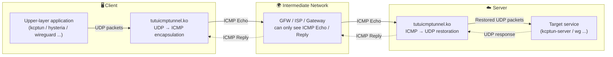
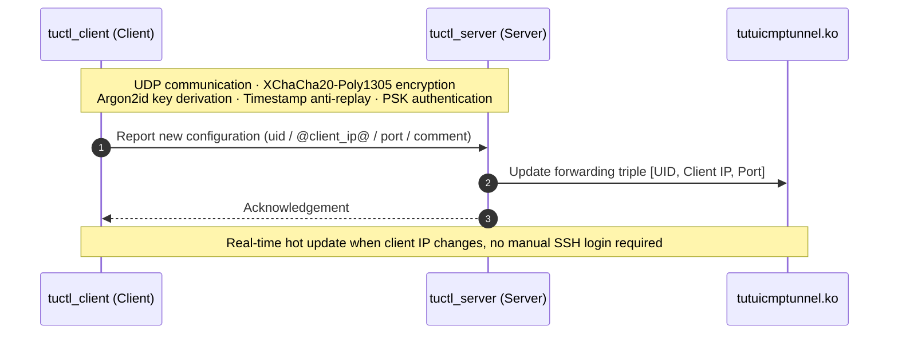
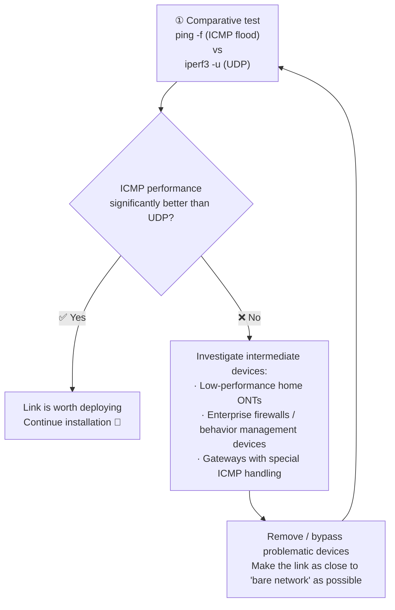

[English](./README.md) | [简体中文](./README_zh-CN.md)

---

<div align="center">

# 🚇 tutuicmptunnel-kmod

**A `UDP` ⇄ `ICMP` tunneling tool based on `nftables` kernel module**

Can serve as a high-performance alternative to `udp2raw` ICMP mode.

> **⭐ Officially Recommended Best Companion: [ShadowQUIC](https://github.com/spongebob888/shadowquic)** — A Rust-based QUIC proxy that pairs perfectly with `tutuicmptunnel-kmod` for maximum performance and stealth.

Also works well with `kcptun` / `hysteria` / `wireguard` and other tools,
jointly coping with increasingly strict UDP QoS and packet loss policies, effectively improving penetration capability and connection stability.

[](https://www.gnu.org/licenses/old-licenses/gpl-2.0.en.html)
[](#-operating-system-requirements-and-dependencies)
[](#)
[](https://github.com/hrimfaxi/tutuicmptunnel/blob/master/docs/benchmark.md)

[Features](#-features) • [Architecture](#-architecture-overview) • [Installation](#-installation) • [Usage](#-quick-start) • [Use Cases](#-main-use-cases) • [Acknowledgements](#-acknowledgements)

</div>

---

## ✨ Features

- 🚀 **High Performance** — Under the same CPU, maximum throughput is several times faster than `udp2raw`, with much lower CPU usage (see [Benchmark](https://github.com/hrimfaxi/tutuicmptunnel/blob/master/docs/benchmark.md))
- ⚡ **Faster than BPF version** — Approximately **22%** faster than the BPF-based `tutuicmptunnel`, and supports OpenWrt without recompiling the kernel
- 🔐 **Secure Design** — Configuration synchronization uses `XChaCha20-Poly1305` + `Argon2id` + timestamp + PSK authentication
- 🌐 **Dual-Stack Support** — Simultaneously supports `ICMP` / `ICMPv6` over IPv4 / IPv6
- 🔄 **Hot Configuration Sync** — Securely and quickly synchronize server and client configuration via `tuctl_server` / `tuctl_client`
- 🔗 **Interoperable** — Interchangeable communication with the BPF version of `tutuicmptunnel` (one end as server, the other as client)
- 🧩 **Single Responsibility** — Handles encapsulation, forwarding, and simple XOR obfuscation; encryption and integrity verification are delegated to upper-layer tools (WireGuard / hysteria / xray, etc.)

---

## 🏗 Architecture Overview

`tutuicmptunnel-kmod` is divided into **server** and **client** parts, each running the corresponding program. Each host can only play one of the two roles.

The data path is as follows:



Configuration synchronization path (optional, independent of the data plane):



### 🆔 UID Mechanism

- To distinguish packets from different clients, each client connecting to the server is assigned a unique `UID` (range **0 ~ 255**), which maps to the `code` field of the `ICMP` protocol — therefore **each server supports a maximum of 256 clients**.
- `UID` is only unique within the scope of each server: a client can use the same `UID` on different servers, or use different `UIDs` to connect to multiple servers.
  - For example: map host `1.2.3.4:3322` to `uid 100`, and host `2.3.4.5:2233` to `uid 101`.

### 📦 Forwarding Triple

| Role | Triple | Purpose |
| :--- | :--- | :--- |
| Client | `[UID, Server IP, Target Port]` | Identifies which `UDP` packets need to be converted to `ICMP` packets |
| Server | `[UID, Client IP, Target Port]` | Identifies which `ICMP` packets need to be restored and forwarded as `UDP` packets |

> 💡 IP addresses can be IPv4 or IPv6; `tutuicmptunnel-kmod` will automatically select `ICMP` or `ICMPv6` for encapsulation and forwarding based on the IP type.

### 🎯 Design Principles

- Can be used in combination with `WireGuard`, `xray-core` + `kcptun`, `hysteria` and other tools. Since these tools already have built-in encryption and integrity verification capabilities, `tutuicmptunnel-kmod` provides simple XOR obfuscation and is **not responsible for encryption and verification**, mainly handling encapsulation and forwarding.
- **Does not modify packet payload content**, nor does it add extra IP headers to packets.
- Server-side forwarding rules are entirely configured manually by the user via triples (can be invoked via [ktuctl](ktuctl/README.md) over SSH, or dynamically synchronized using `tuctl_client`).

---

## 🔍 Survey Preparation: Step 0

Before deploying `tutuicmptunnel-kmod`, first verify whether the current link is suitable for carrying an ICMP tunnel. The core idea: **compare the actual performance of ICMP vs UDP on the same link**.



1. **Perform ICMP / UDP comparative test**
   - Use `ping -f` or other ICMP flood methods to observe ICMP responsiveness and packet loss
   - Use `iperf3 -u -c ...` for UDP performance comparison testing
   - If ICMP stability, throughput, or latency is **significantly better than UDP**, the link is worth deploying

2. **If ICMP performance is not as expected**
   This indicates there may be interfering factors in the link. Common issues include:
   - Low-performance, poorly implemented home ONTs (try switching the ONT to bridge mode and have the router handle dialing to mitigate ICMP rate limiting)
   - Various "enterprise-grade" firewalls, internet behavior management devices, or other gateways that specially handle ICMP

   > ⚠️ Such devices sometimes have underlying filtering, rate limiting, or policy processing logic that cannot be truly disabled — even when the web interface shows "firewall is off". It looks turned off, but it actually isn't.

3. **Re-test after removing intermediate devices**
   Remove problematic ONTs and bypass relevant firewalls as much as possible to bring the test link close to a "bare network" state, then repeat Step 1. Only after eliminating the influence of intermediate devices can you accurately determine whether the link is suitable for deployment.

---

## 💻 Operating System Requirements and Dependencies

<details open>
<summary><b>Ubuntu</b>（≥ 20.04, recommended 24.04 LTS and above）</summary>

```sh
sudo apt install -y git libsodium-dev dkms build-essential \
    linux-headers-$(uname -r) flex bison libmnl-dev cmake pkg-config
```

</details>

<details>
<summary><b>Arch Linux</b>（latest）</summary>

```sh
sudo pacman -S git libsodium dkms base-devel linux-headers \
    flex bison libmnl cmake pkg-config
```

</details>

<details>
<summary><b>OpenWrt</b>（≥ 24.10.1）</summary>

Please refer to the 📖 [OpenWrt Guide](docs/openwrt.md).

For convenient deployment on OpenWrt, the following companion projects are provided:

| Project | Description |
| :--- | :--- |
| [tumgrd](https://github.com/hrimfaxi/tumgrd) | OpenWrt daemon for `tutuicmptunnel-kmod`, responsible for automatic kernel module loading and configuration management |
| [openwrt-tumgrd](https://github.com/hrimfaxi/openwrt-tumgrd) | OpenWrt package Makefile for compiling and packaging `tumgrd` |
| [luci-app-tumgrd](https://github.com/hrimfaxi/luci-app-tumgrd) | LuCI Web interface plugin, providing graphical configuration and status monitoring |

Through these three projects, the following can be achieved:
- 📦 One-click installation and automatic updates
- 🖥️ LuCI Web interface graphical configuration
- 🔄 Auto-start on boot and status monitoring

</details>

---

## 📥 Installation

### 1️⃣ Clone the code and compile

```sh
git clone https://github.com/hrimfaxi/tutuicmptunnel-kmod
cd tutuicmptunnel-kmod
cmake -DCMAKE_BUILD_TYPE=Release -DENABLE_HARDEN_MODE=1 .
make
sudo make install
```

### 2️⃣ Install the kernel module

Both server and client need to install [tutuicmptunnel.ko](kmod/README.md) — this is the main program of this tool.

```sh
cd kmod
# If a previous version was installed (check with dkms status), remove it first:
sudo dkms remove tutuicmptunnel/x.x --all
sudo make dkms
sudo tee -a /etc/modules-load.d/modules.conf <<< tutuicmptunnel
sudo modprobe tutuicmptunnel
```

> 💡 Some systems require setting the `force_sw_checksum` parameter. See [kmod documentation](kmod/README.md#force_sw_checksum) for details.

### 3️⃣ Server: Set up systemd service and enable optional `tuctl_server`

`tuctl_server` can help clients remotely control server-side configuration. Before using, please note:

- 🔑 To prevent brute-force attacks, choose a sufficiently strong `PSK` (recommended to generate with `uuidgen -r`)
- 🕒 Since timestamp verification is used, both server and client need accurate system time (NTP synchronization)

```sh
# Auto-load tutuicmptunnel-kmod service on boot and restore configuration
sudo cp contrib/etc/systemd/system/tutuicmptunnel-kmod-server@.service /etc/systemd/system/
sudo systemctl enable --now tutuicmptunnel-kmod-server@eth0.service  # eth0 is the server network interface

# Optional tuctl_server
sudo cp contrib/etc/systemd/system/tutuicmptunnel-tuctl-server.service /etc/systemd/system/
# Edit psk, port, etc.
sudo vim /etc/systemd/system/tutuicmptunnel-tuctl-server.service
timedatectl | grep "System clock synchronized:"  # Verify system time is NTP synchronized
sudo systemctl daemon-reload
sudo systemctl enable --now tutuicmptunnel-tuctl-server
```

Now you can use `ktuctl` to check the server status:

```console
$ sudo ktuctl
tutuicmptunnel-kmod: Role: Server, BPF build type: Release

Peers:
....
```

<details>
<summary>👉 Start server mode manually without systemd</summary>

```sh
sudo modprobe -r tutuicmptunnel                                        # Unload module
sudo modprobe tutuicmptunnel                                           # Reload
sudo ktuctl server                                                     # Set to server mode
sudo ktuctl server-add uid 123 address 1.2.3.4 port 1234               # Add client (uid 123, ip 1.2.3.4, target udp port 1234)
sudo ktuctl server-del uid 123                                         # Delete client
```

</details>

### 4️⃣ Optional: Set up UID and hostname mapping table

For easier management, `tutuicmptunnel-kmod` supports mapping hostnames to `UIDs` via `/etc/tutuicmptunnel/uids`:

```sh
sudo mkdir -p /etc/tutuicmptunnel
sudo vim /etc/tutuicmptunnel/uids
```

File format:

```text
#
# Format: UID hostname # optional comment
#

0 alice # alice's laptop
1 bob   # bob's laptop
```

Once configured, all places in the `ktuctl` command that require specifying a `UID` (e.g. `uid 0`) can use the hostname directly (e.g. `user alice`) instead, making management more intuitive.

### 5️⃣ Client: Set up systemd service and enable

```sh
sudo cp contrib/etc/systemd/system/tutuicmptunnel-kmod-client@.service /etc/systemd/system/
sudo systemctl enable --now tutuicmptunnel-kmod-client@enp4s0  # enp4s0 is your network interface
```

---

## 🚀 Quick Start

Client configuration example:

```sh
export ADDRESS=yourserver.com   # Server domain or IP
export PORT=3322                # UDP port to be converted to ICMP
export TUTU_UID=123             # tutuicmptunnel user ID
export PSK=yourlongpsk          # PSK for tuctl_server
export SERVER_PORT=14801        # Port for tuctl_server
export COMMENT=yourname         # Client identity description (visible in server ktuctl output)

# Set to client mode
sudo ktuctl client
# Add server endpoint configuration
sudo ktuctl client-add uid $TUTU_UID address $ADDRESS port $PORT
# Verify configuration
sudo ktuctl status
# Use tuctl_client to notify the server to sync new configuration
tuctl_client psk $PSK server $ADDRESS server-port $SERVER_PORT \
    <<< "server-add uid $TUTU_UID address @client_ip@ port $PORT comment $COMMENT"
```

Then confirm on the server that the rule has taken effect:

```console
$ sudo ktuctl
tutuicmptunnel-kmod: Role: Server, BPF build type: Release

Peers:
  User: xxxx, Address: xxx.xxx.xxx.xxx, Sport: 37926, Dport: 3322, ICMP: 11403, Comment: yourname
```

✅ Once everything is ready: `UDP` traffic sent by the client to port `3322` will be automatically encapsulated as `ICMP`; the server receives and restores it to `UDP` for continued forwarding. **During the entire transmission, intermediate nodes can only see `ICMP Echo` / `Reply` packets.**

---

## 🧰 Main Use Cases

| Name | Description |
| :--- | :--- |
| [ShadowQUIC](docs/shadowquic.md) | **⭐ Recommended** — Rust-based QUIC proxy, the officially recommended best companion for `tutuicmptunnel-kmod` |
| [hysteria](docs/hysteria.md) | Proxy tool based on the QUIC protocol, optimized for unstable and high packet-loss networks |
| [iperf3](docs/iperf3.md) | Powerful network performance testing tool for measuring bandwidth, jitter, and packet loss |
| [xray + hysteria](docs/xray_hysteria.md) | Combination of Xray core and Hysteria protocol for accelerating and stabilizing network connections |
| [xray + kcptun](docs/xray_kcptun.md) | Combination of Xray core and KCPTun protocol for accelerating and stabilizing network connections |
| [xray + mkcp](docs/xray_mkcp.md) | Xray core with its built-in mKCP implementation for accelerating and stabilizing network connections |
| [xray + dns](docs/xray_dns.md) | Forward DNS on VPS using xray-core (dokodemo-door), and encapsulate UDP as ICMP on the OpenWrt side for transmission |
| [wireguard](docs/wireguard.md) | Modern, high-performance, and easy-to-configure secure VPN tunnel |
| [openwrt](docs/openwrt.md) | Highly customizable Linux operating system for embedded devices (especially routers) |
| [mosh](docs/mosh.md) | SSH-initiated, UDP-transmitted roaming shell that supports reconnection and maintains smooth interaction under high-latency/jitter networks |

---

## 🙏 Acknowledgements

During the design, implementation, and performance tuning of `tutuicmptunnel-kmod`, we have referenced and benefited from numerous excellent open-source projects and technical articles. We sincerely thank their authors and community contributors!

- [hysteria](https://github.com/apernet/hysteria)
- [shadowquic](https://github.com/spongebob888/shadowquic)
- [kcptun](https://github.com/xtaci/kcptun)
- [xray-core](https://github.com/XTLS/Xray-core)
- [udp2raw](https://github.com/wangyu-/udp2raw)
- [mimic](https://github.com/hack3ric/mimic)
- [libbpf-bootstrap](https://github.com/libbpf/libbpf-bootstrap)

Special thanks to [@hack3ric](https://github.com/hack3ric) and all contributors for their continuous maintenance, making `UDP` → `fakeTCP` obfuscation on eBPF possible.

---

## 📄 License

This project as a whole is licensed under the **GNU General Public License v2.0**.
The `libbpf` and `bpftool` submodules retain their respective original licenses (`LGPL-2.1` / `BSD-2-Clause`).
