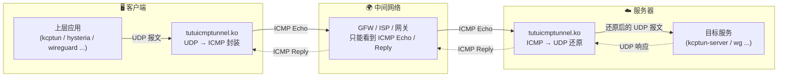
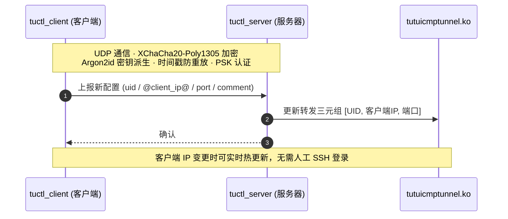
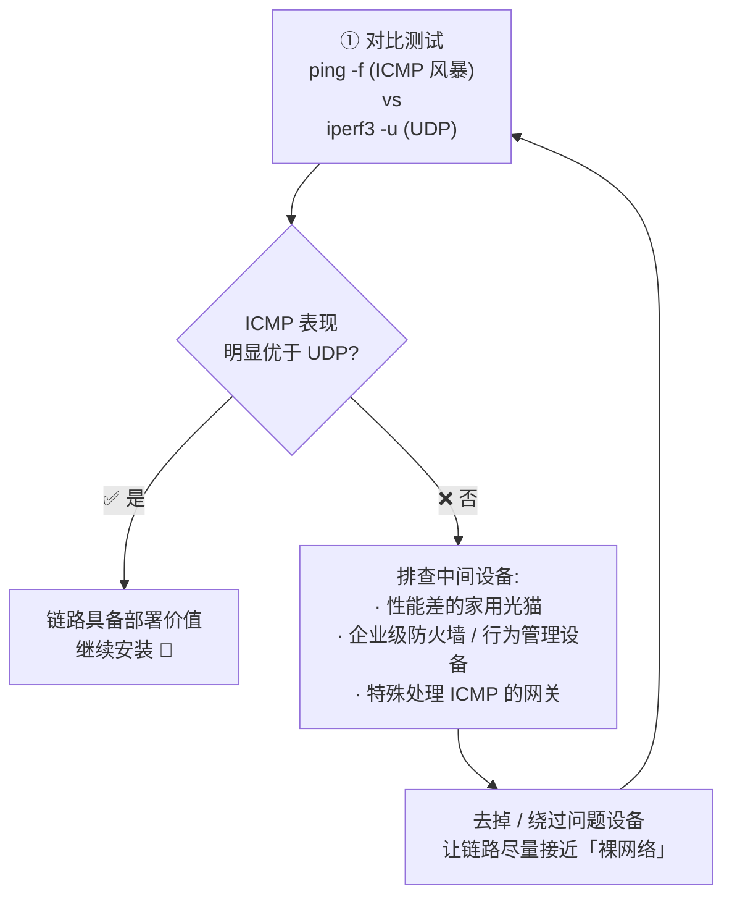

[English](./README.md) | [简体中文](./README_zh-CN.md)

---

<div align="center">

# 🚇 tutuicmptunnel-kmod

**基于 `nftables` 内核模块的 `UDP` ⇄ `ICMP` 隧道工具**

可作为 `udp2raw` ICMP 模式的高性能替代方案，
推荐与 `kcptun` / `hysteria` / `wireguard` 等工具配合使用，
共同应对日益严厉的 UDP QoS 与丢包策略，有效提升穿透能力与连接稳定性。

[](https://www.gnu.org/licenses/old-licenses/gpl-2.0.en.html)
[](#-操作系统要求与依赖)
[](#)
[](https://github.com/hrimfaxi/tutuicmptunnel/blob/master/docs/benchmark.md)

[特性](#-特性) • [架构](#-架构概览) • [安装](#-安装方法) • [使用](#-快速上手) • [应用场景](#-主要应用场景) • [致谢](#-致谢)

</div>

---

## ✨ 特性

- 🚀 **高性能** — 同等 CPU 下最大流量比 `udp2raw` 快数倍，且 CPU 占用低得多（参见 [性能测试](https://github.com/hrimfaxi/tutuicmptunnel/blob/master/docs/benchmark.md)）
- ⚡ **比 BPF 版更快** — 相比基于 BPF 的 `tutuicmptunnel` 快约 **22%**，且无需重编译内核即可支持 OpenWrt
- 🔐 **安全设计** — 配置同步采用 `XChaCha20-Poly1305` + `Argon2id` + 时间戳 + PSK 认证
- 🌐 **双栈支持** — 同时支持 IPv4 / IPv6 下的 `ICMP` / `ICMPv6`
- 🔄 **配置热同步** — 通过 `tuctl_server` / `tuctl_client` 安全、迅速地同步服务器与客户端配置
- 🔗 **互通兼容** — 与 BPF 版 `tutuicmptunnel` 可互换通信（一端做服务器，另一端做客户端）
- 🧩 **职责单一** — 负责封装、转发与简单 XOR 混淆，加密与完整性校验交给上层工具（WireGuard / hysteria / xray 等）

---

## 🏗 架构概览

`tutuicmptunnel-kmod` 分为**服务器端**与**客户端**两部分，双方各自运行对应程序。每台主机只能扮演其中一种角色。

数据通路如下：



配置同步通路（可选，独立于数据面）：



### 🆔 UID 机制

- 为区分不同客户端的报文，每个接入服务器的客户端会被分配一个唯一的 `UID`（取值范围 **0 ~ 255**），该 `UID` 对应 `ICMP` 协议的 `code` 字段 —— 因此**每台服务器最多支持 256 个客户端**。
- `UID` 仅在每台服务器范围内唯一：客户端可以在不同服务器上使用相同的 `UID`，也可以用不同的 `UID` 接入多台服务器。
  - 例如：将主机 `1.2.3.4:3322` 映射为 `uid 100`，主机 `2.3.4.5:2233` 映射为 `uid 101`。

### 📦 转发三元组

| 角色 | 三元组 | 作用 |
| :--- | :--- | :--- |
| 客户端 | `[UID, 服务器IP, 目标端口]` | 标识哪些 `UDP` 包需要被转换为 `ICMP` 包 |
| 服务器 | `[UID, 客户端IP, 目标端口]` | 标识哪些 `ICMP` 包需要被还原并转发为 `UDP` 包 |

> 💡 IP 地址可以是 IPv4 或 IPv6，`tutuicmptunnel-kmod` 会根据 IP 类型自动选择 `ICMP` 或 `ICMPv6` 进行封装和转发。

### 🎯 设计原则

- 可与 `WireGuard`、`xray-core` + `kcptun`、`hysteria` 等工具搭配使用。由于这些软件本身已具备加密和完整性校验能力，`tutuicmptunnel-kmod` 提供简单 XOR 混淆，**不负责加密与校验**，主要负责封装与转发。
- **不修改数据包负载内容**，也不会在报文中添加额外的 IP 头部。
- 服务器端转发规则完全由用户手动通过三元组配置（可通过 [ktuctl](ktuctl/README_zh-CN.md) 经 SSH 调用，或使用 `tuctl_client` 动态同步）。

---

## 🔍 勘测准备：第 0 步

在落地 `tutuicmptunnel-kmod` 之前，先确认当前链路是否适合承载 ICMP 隧道。核心思路：**对比 ICMP 与 UDP 在同一链路下的实际表现**。



1. **进行 ICMP / UDP 对比测试**
   - 使用 `ping -f` 或其他 ICMP 风暴方式，观察 ICMP 的响应能力与丢包情况
   - 使用 `iperf3 -u -c ...` 对 UDP 性能进行对比测试
   - 若 ICMP 的稳定性、吞吐或时延**明显优于 UDP**，说明这条链路具备部署价值

2. **如果 ICMP 表现不如预期**
   说明链路中可能存在干扰因素，常见问题包括：
   - 性能较差、实现粗糙的家用光猫（可尝试将光猫改为桥接模式，由路由器拨号，以缓解 ICMP 限速问题）
   - 各类"企业级"防火墙、上网行为管理设备，或其他会特殊处理 ICMP 的网关

   > ⚠️ 这类设备有时即使 Web 界面显示"防火墙已关闭"，底层仍可能存在无法真正关闭的过滤、限速或策略处理逻辑 —— 看起来关掉了，实际并没有。

3. **排除中间设备后重新测试**
   尽可能去掉问题光猫、绕过相关防火墙，让测试链路接近"裸网络"状态，然后重复第 1 步。只有排除中间设备影响后，才能准确判断链路是否适合部署。

---

## 💻 操作系统要求与依赖

<details open>
<summary><b>Ubuntu</b>（≥ 20.04，建议 24.04 LTS 及以上）</summary>

```sh
sudo apt install -y git libsodium-dev dkms build-essential \
    linux-headers-$(uname -r) flex bison libmnl-dev cmake pkg-config
```

</details>

<details>
<summary><b>Arch Linux</b>（最新即可）</summary>

```sh
sudo pacman -S git libsodium dkms base-devel linux-headers \
    flex bison libmnl cmake pkg-config
```

</details>

<details>
<summary><b>OpenWrt</b>（≥ 24.10.1）</summary>

请参阅 📖 [OpenWrt 指南](docs/openwrt.md)。

为方便在 OpenWrt 上部署，提供以下配套项目：

| 项目 | 说明 |
| :--- | :--- |
| [tumgrd](https://github.com/hrimfaxi/tumgrd) | `tutuicmptunnel-kmod` 的 OpenWrt 守护进程，负责自动管理内核模块加载与配置 |
| [openwrt-tumgrd](https://github.com/hrimfaxi/openwrt-tumgrd) | OpenWrt 软件包 Makefile，用于编译打包 `tumgrd` |
| [luci-app-tumgrd](https://github.com/hrimfaxi/luci-app-tumgrd) | LuCI Web 界面插件，提供图形化配置与状态监控 |

通过这三个项目，可以实现：
- 📦 一键安装与自动更新
- 🖥️ LuCI Web 界面图形化配置
- 🔄 开机自启与状态监控

</details>

---

## 📥 安装方法

### 1️⃣ 检出代码并编译安装

```sh
git clone https://github.com/hrimfaxi/tutuicmptunnel-kmod
cd tutuicmptunnel-kmod
cmake -DCMAKE_BUILD_TYPE=Release -DENABLE_HARDEN_MODE=1 .
make
sudo make install
```

### 2️⃣ 安装内核模块

服务器和客户端都需要安装 [tutuicmptunnel.ko](kmod/README_zh-CN.md) —— 这是本工具的主体程序。

```sh
cd kmod
# 如果之前安装过旧版本（可用 dkms status 查看），先移除：
sudo dkms remove tutuicmptunnel/x.x --all
sudo make dkms
sudo tee -a /etc/modules-load.d/modules.conf <<< tutuicmptunnel
sudo modprobe tutuicmptunnel
```

> 💡 部分系统需要设置 `force_sw_checksum` 参数，详见 [kmod 文档](kmod/README_zh-CN.md#force_sw_checksum)。

### 3️⃣ 服务器：设置系统服务并启用可选的 `tuctl_server`

`tuctl_server` 可以帮助客户端远程控制服务器端的配置。使用前请注意：

- 🔑 为防止暴力破解，请选择足够强的 `PSK`（推荐 `uuidgen -r` 生成）
- 🕒 由于采用时间戳验证，服务器与客户端都需要准确的系统时间（NTP 同步）

```sh
# 开机自动加载 tutuicmptunnel-kmod 服务并恢复配置
sudo cp contrib/etc/systemd/system/tutuicmptunnel-kmod-server@.service /etc/systemd/system/
sudo systemctl enable --now tutuicmptunnel-kmod-server@eth0.service  # eth0 为服务器网络接口

# 可选的 tuctl_server
sudo cp contrib/etc/systemd/system/tutuicmptunnel-tuctl-server.service /etc/systemd/system/
# 修改 psk、端口等
sudo vim /etc/systemd/system/tutuicmptunnel-tuctl-server.service
timedatectl | grep "System clock synchronized:"  # 确认系统时间已 NTP 同步
sudo systemctl daemon-reload
sudo systemctl enable --now tutuicmptunnel-tuctl-server
```

此时可以使用 `ktuctl` 检查服务器状态：

```console
$ sudo ktuctl
tutuicmptunnel-kmod: Role: Server, BPF build type: Release

Peers:
....
```

<details>
<summary>👉 不使用 systemd，手动启动服务器模式</summary>

```sh
sudo modprobe -r tutuicmptunnel                                        # 卸载模块
sudo modprobe tutuicmptunnel                                           # 重新加载
sudo ktuctl server                                                     # 设置为服务器模式
sudo ktuctl server-add uid 123 address 1.2.3.4 port 1234               # 添加客户端 (uid 123, ip 1.2.3.4, 目的 udp 端口 1234)
sudo ktuctl server-del uid 123                                         # 删除该客户端
```

</details>

### 4️⃣ 可选：设置 UID 与主机名映射表

为了便于管理，`tutuicmptunnel-kmod` 支持通过 `/etc/tutuicmptunnel/uids` 将主机名与 `UID` 对应：

```sh
sudo mkdir -p /etc/tutuicmptunnel
sudo vim /etc/tutuicmptunnel/uids
```

文件格式：

```text
#
# 格式： UID 主机名 # 可选的注释
#

0 alice # alice's laptop
1 bob   # bob's laptop
```

设置完成后，`ktuctl` 命令中所有需要指定 `UID`（如 `uid 0`）的地方，都可以直接使用主机名（如 `user alice`）替代，管理更加直观。

### 5️⃣ 客户端：设置系统服务并启用

```sh
sudo cp contrib/etc/systemd/system/tutuicmptunnel-kmod-client@.service /etc/systemd/system/
sudo systemctl enable --now tutuicmptunnel-kmod-client@enp4s0  # enp4s0 为你的上网接口
```

---

## 🚀 快速上手

客户端配置示例：

```sh
export ADDRESS=yourserver.com   # 服务器域名或 IP
export PORT=3322                # 需要转换为 ICMP 的 UDP 端口
export TUTU_UID=123             # tutuicmptunnel 用户 ID
export PSK=yourlongpsk          # tuctl_server 的 PSK
export SERVER_PORT=14801        # tuctl_server 的端口
export COMMENT=yourname         # 客户端身份描述（可在服务器 ktuctl 输出中查看）

# 设置为客户端模式
sudo ktuctl client
# 添加服务器端点配置
sudo ktuctl client-add uid $TUTU_UID address $ADDRESS port $PORT
# 验证配置
sudo ktuctl status
# 使用 tuctl_client 通知服务器同步新配置
tuctl_client psk $PSK server $ADDRESS server-port $SERVER_PORT \
    <<< "server-add uid $TUTU_UID address @client_ip@ port $PORT comment $COMMENT"
```

然后在服务器上确认规则已生效：

```console
$ sudo ktuctl
tutuicmptunnel-kmod: Role: Server, BPF build type: Release

Peers:
  User: xxxx, Address: xxx.xxx.xxx.xxx, Sport: 37926, Dport: 3322, ICMP: 11403, Comment: yourname
```

✅ 一切就绪后：客户端发往 `3322` 端口的 `UDP` 通信会被自动封装为 `ICMP` 发出；服务器收到后还原为 `UDP` 继续转发。**整个传输过程中，中间节点只能看到 `ICMP Echo` / `Reply` 报文。**

---

## 🧰 主要应用场景

| 名称 | 简介 |
| :--- | :--- |
| [iperf3](docs/iperf3.md) | 强大的网络性能测试工具，用于测量带宽、抖动和丢包 |
| [hysteria](docs/hysteria.md) | 基于 QUIC 协议的代理工具，专为不稳定和高丢包网络优化 |
| [shadowquic](docs/shadowquic.md) | 基于 Rust 和 QUIC 协议的代理工具，专为不稳定和高丢包网络优化 |
| [xray + hysteria](docs/xray_hysteria.md) | Xray 核心与 Hysteria 协议的组合，用于加速和稳定网络连接 |
| [xray + kcptun](docs/xray_kcptun.md) | Xray 核心与 KCPTun 协议的组合，用于加速和稳定网络连接 |
| [xray + mkcp](docs/xray_mkcp.md) | Xray 核心与自带的 mKCP 实现，用于加速和稳定网络连接 |
| [xray + dns](docs/xray_dns.md) | 在 VPS 上用 xray-core（dokodemo-door）转发 DNS，并在 OpenWrt 侧将 UDP 封装为 ICMP 传输 |
| [wireguard](docs/wireguard.md) | 现代化、高性能且配置简单的安全 VPN 隧道 |
| [openwrt](docs/openwrt.md) | 针对嵌入式设备（尤其是路由器）的高度可定制化 Linux 操作系统 |
| [mosh](docs/mosh.md) | 基于 SSH 启动、以 UDP 传输的漫游 Shell，支持断线重连，在高延迟/抖动网络下保持交互顺畅 |

---

## 🙏 致谢

`tutuicmptunnel-kmod` 在设计、实现和性能调优过程中，参考并受益于大量优秀的开源项目和技术文章。谨向它们的作者及社区贡献者致以诚挚感谢！

- [hysteria](https://github.com/apernet/hysteria)
- [shadowquic](https://github.com/spongebob888/shadowquic)
- [kcptun](https://github.com/xtaci/kcptun)
- [xray-core](https://github.com/XTLS/Xray-core)
- [udp2raw](https://github.com/wangyu-/udp2raw)
- [mimic](https://github.com/hack3ric/mimic)
- [libbpf-bootstrap](https://github.com/libbpf/libbpf-bootstrap)

特别鸣谢 [@hack3ric](https://github.com/hack3ric) 及所有贡献者的持续维护，让 eBPF 上 `UDP` → `fakeTCP` 混淆成为可能。

---

## 📄 许可证

本项目整体遵循 **GNU General Public License v2.0**。
其中 `libbpf`、`bpftool` 子模块保留其各自原始许可证（`LGPL-2.1` / `BSD-2-Clause`）。
