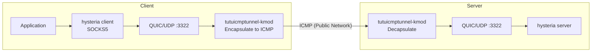

# Protecting hysteria Traffic with tutuicmptunnel-kmod

[English](./hysteria.md) | [简体中文](./hysteria_zh-CN.md)

---

`hysteria` uses UDP/QUIC transport, which is susceptible to ISP QoS throttling and interference targeting UDP. With `tutuicmptunnel-kmod`, you can encapsulate hysteria's UDP traffic into ICMP packets for transmission:



> [!WARNING]
> All parameters in this documentation are placeholders (domains, keys, IPs, etc.). Please replace them according to your actual situation. Do not leave plaintext credentials (SNI, passwords, IPs, etc.) in public spaces.

## Prerequisites

* A working `hysteria` configuration with UDP port `3322`
* `curl` installed on the client:

```bash
# Ubuntu
sudo apt-get install curl

# Arch Linux
sudo pacman -S curl
```

## Deployment

### 1. Assign UID

Select a unique `UID` for each client device on the server. In this example, the hostname is `a320` and the `UID` is `100`.

Add the following record to `/etc/tutuicmptunnel/uids` on the **server**:

```text
100 a320
```

Add the same record to `/etc/tutuicmptunnel/uids` on the **client** as well.

### 2. Modify systemd Unit (Server)

> [!IMPORTANT]
> `tutuicmptunnel-kmod` cannot handle GSO packets. You must disable hysteria's GSO functionality via the environment variable `QUIC_GO_DISABLE_GSO=1`. This must be set on both client and server.

`/etc/systemd/system/hysteria-server@.service`:

```ini
[Unit]
Description=Hysteria Server (%i.yaml)
After=network.target tutuicmptunnel.service

[Service]
Type=simple
ExecStart=/usr/local/bin/hysteria server --config /etc/hysteria/%i.yaml
DynamicUser=yes
Environment=HYSTERIA_LOG_LEVEL=info QUIC_GO_DISABLE_GSO=1
CapabilityBoundingSet=CAP_NET_ADMIN CAP_NET_BIND_SERVICE CAP_NET_RAW
AmbientCapabilities=CAP_NET_ADMIN CAP_NET_BIND_SERVICE CAP_NET_RAW
NoNewPrivileges=true
Restart=on-failure

[Install]
WantedBy=multi-user.target
```

### 3. Configure Client IP Sync Script

The client can remotely update `ktuctl` rules on the server via `tuctl_client`. This way, even if the client's public IP changes, the server can be notified promptly.

Create `/usr/local/bin/tutuicmptunnel_sync.sh`:

```bash
#!/bin/bash

# This script runs on the client to notify the server of client configuration updates via tuctl_client.

V() {
  echo "$@"
  "$@"
}

TMP=$(mktemp)
export DEV=eth0 # Your client's network interface name
sudo ktuctl dump > $TMP
sudo rmmod tutuicmptunnel
sudo modprobe tutuicmptunnel

export TUTU_UID=100 # Replace with the UID or username you selected on the server
export ADDRESS=yourdomain.com # Replace with your hysteria server domain or IP
export PORT=3322 # Replace with your hysteria server UDP port

sudo ktuctl script - < $TMP
sudo ktuctl client
sudo ktuctl client-del address $ADDRESS user $TUTU_UID
sudo ktuctl client-add address $ADDRESS port $PORT user $TUTU_UID

export COMMENT=yourdevice # Replace with your client's comment, which will be displayed in the server's ktuctl command
export HOST=$ADDRESS
export PSK=yourlongpsk # Replace with your tuctl_server PSK passphrase
export SERVER_PORT=your_tuserver_port # Replace with your tuctl_server port

echo "server-add uid $TUTU_UID address @client_ip@ port $PORT comment $COMMENT" | V tuctl_client \
  psk $PSK \
  server $HOST \
  server-port $SERVER_PORT

# vim: set sw=2 ts=2 expandtab:
```

### 4. Start

```bash
# First sync client IP to server
/usr/local/bin/tutuicmptunnel_sync.sh

# Then start hysteria client (also requires GSO to be disabled)
QUIC_GO_DISABLE_GSO=1 hysteria client -c client.yaml
```

### 5. (Optional) Periodic Client IP Sync

If the client's public IP changes frequently, you need to periodically update the IP on the server. You can use `crontab` to run the sync script every 5 minutes:

```cron
PATH=/usr/local/sbin:/usr/local/bin:/usr/bin:/usr/sbin:/bin:/sbin
*/5 * * * * /usr/local/bin/tutuicmptunnel_sync.sh
```

Alternatively, you can use a `systemd` timer to achieve the same effect:

`/etc/systemd/system/tutuicmptunnel_sync.service`:

```ini
[Unit]
Description=Sync tutuicmptunnel config

[Service]
Type=oneshot
Environment=PATH=/usr/local/sbin:/usr/local/bin:/usr/bin:/usr/sbin:/bin:/sbin
ExecStart=/usr/local/bin/tutuicmptunnel_sync.sh
```

`/etc/systemd/system/tutuicmptunnel_sync.timer`:

```ini
[Unit]
Description=Run tutuicmptunnel_sync every 5 minutes

[Timer]
OnBootSec=5min
OnUnitActiveSec=5min
Persistent=true

[Install]
WantedBy=timers.target
```

> [!NOTE]
> Don't forget to run `systemctl daemon-reload` and enable the timer: `systemctl enable --now tutuicmptunnel_sync.timer`.

## Verification and Testing

**Speed test:**

```bash
hysteria speedtest -c client.yaml
```

**View ICMP tunnel count:**

```bash
sudo ktuctl -d
```

**Packet capture to confirm ICMP traffic:**

```bash
sudo tcpdump -i any icmp -n -v
```