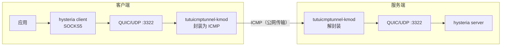

# 使用 tutuicmptunnel-kmod 保护 hysteria 流量

`hysteria` 基于 UDP/QUIC 传输，同样容易受到 ISP 针对 UDP 的 QoS 限速与干扰。通过 `tutuicmptunnel-kmod`，可以将 hysteria 的 UDP 流量封装为 ICMP 报文传输：



> [!WARNING]
> 本文所有参数均为占位符（域名、密钥、IP 等），请按实际情况替换。请勿在公开场合泄露真实的 SNI、密码、IP 等敏感信息。

## 前提条件

* 已有一份可用的 `hysteria` 配置，UDP 端口为 `3322`
* 客户端已安装 `curl`：

```bash
# Ubuntu
sudo apt-get install curl

# Arch Linux
sudo pacman -S curl
```

## 部署

### 1. 分配 UID

为每台客户端设备在服务器上选定一个唯一的 `UID`。本例中主机名为 `a320`，`UID` 为 `100`。

在**服务器**的 `/etc/tutuicmptunnel/uids` 中添加：

```text
100 a320
```

**客户端**的 `/etc/tutuicmptunnel/uids` 中也添加同样的记录。

### 2. 修改 systemd 单元（服务端）

> [!IMPORTANT]
> `tutuicmptunnel-kmod` 无法处理 GSO 包，必须通过环境变量 `QUIC_GO_DISABLE_GSO=1` 关闭 hysteria 的 GSO 功能，客户端和服务端都需要设置。

`/etc/systemd/system/hysteria-server@.service`：

```ini
[Unit]
Description=Hysteria Server (%i.yaml)
After=network.target tutuicmptunnel.service

[Service]
Type=simple
ExecStart=/usr/local/bin/hysteria server --config /etc/hysteria/%i.yaml
DynamicUser=yes
Environment=HYSTERIA_LOG_LEVEL=info QUIC_GO_DISABLE_GSO=1
CapabilityBoundingSet=CAP_NET_ADMIN CAP_NET_BIND_SERVICE CAP_NET_RAW
AmbientCapabilities=CAP_NET_ADMIN CAP_NET_BIND_SERVICE CAP_NET_RAW
NoNewPrivileges=true
Restart=on-failure

[Install]
WantedBy=multi-user.target
```

### 3. 配置客户端 IP 同步脚本

客户端可以通过 `tuctl_client` 远程更新服务器上的 `ktuctl` 规则。这样即使客户端公网 IP 发生变化，也能及时通知服务器。

创建 `/usr/local/bin/tutuicmptunnel_sync.sh`：

```bash
#!/bin/bash

# 本脚本在客户端上运行，通过 tuctl_client 向服务器通告客户端配置的更新。

V() {
  echo "$@"
  "$@"
}

TMP=$(mktemp)
export DEV=eth0 # 你的客户端的上网接口名
sudo ktuctl dump > $TMP
sudo rmmod tutuicmptunnel
sudo modprobe tutuicmptunnel

export TUTU_UID=100 # 替换为你的服务器上选好的uid或用户名
export ADDRESS=yourdomain.com # 替换为你的hysteria服务器域名或IP
export PORT=3322 # 替换为你的hysteria服务器udp端口

sudo ktuctl script - < $TMP
sudo ktuctl client
sudo ktuctl client-del address $ADDRESS user $TUTU_UID
sudo ktuctl client-add address $ADDRESS port $PORT user $TUTU_UID

export COMMENT=yourdevice # 替换为你的客户端的注释，此注释会在服务器的ktuctl命令上显示
export HOST=$ADDRESS
export PSK=yourlongpsk # 替换为你的tuctl_server的PSK口令
export SERVER_PORT=your_tuserver_port # 替换为你的tuctl_server的端口

echo "server-add uid $TUTU_UID address @client_ip@ port $PORT comment $COMMENT" | V tuctl_client \
  psk $PSK \
  server $HOST \
  server-port $SERVER_PORT

# vim: set sw=2 ts=2 expandtab:
```

### 4. 启动

```bash
# 先同步客户端 IP 到服务器
/usr/local/bin/tutuicmptunnel_sync.sh

# 再启动 hysteria 客户端（同样需要关闭 GSO）
QUIC_GO_DISABLE_GSO=1 hysteria client -c client.yaml
```

### 5.（可选）定时同步客户端 IP

如果客户端公网 IP 变动频繁，需要定期向服务器更新 IP。可以用 `crontab` 每 5 分钟运行一次同步脚本：

```cron
PATH=/usr/local/sbin:/usr/local/bin:/usr/bin:/usr/sbin:/bin:/sbin
*/5 * * * * /usr/local/bin/tutuicmptunnel_sync.sh
```

也可以使用 `systemd` timer 达到同样的效果：

`/etc/systemd/system/tutuicmptunnel_sync.service`：

```ini
[Unit]
Description=Sync tutuicmptunnel config

[Service]
Type=oneshot
Environment=PATH=/usr/local/sbin:/usr/local/bin:/usr/bin:/usr/sbin:/bin:/sbin
ExecStart=/usr/local/bin/tutuicmptunnel_sync.sh
```

`/etc/systemd/system/tutuicmptunnel_sync.timer`：

```ini
[Unit]
Description=Run tutuicmptunnel_sync every 5 minutes

[Timer]
OnBootSec=5min
OnUnitActiveSec=5min
Persistent=true

[Install]
WantedBy=timers.target
```

> [!NOTE]
> 别忘了执行 `systemctl daemon-reload` 并启用 timer：`systemctl enable --now tutuicmptunnel_sync.timer`。

## 验证与测试

**测速：**

```bash
hysteria speedtest -c client.yaml
```

**查看 ICMP 隧道计数：**

```bash
sudo ktuctl -d
```

**抓包确认 ICMP 流量：**

```bash
sudo tcpdump -i any icmp -n -v
```
