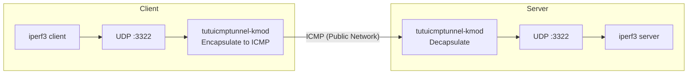

# Testing tutuicmptunnel-kmod Tunnel Performance with iperf3

[English](./iperf3.md) | [简体中文](./iperf3_zh-CN.md)

---

This document demonstrates how to use `ktuctl` to set up a UDP-over-ICMP tunnel between client and server, and perform UDP throughput testing with `iperf3` to verify the tunnel's bandwidth, packet loss rate, and jitter performance.



## Prerequisites

* Both client and server have `tutuicmptunnel-kmod` installed and the kernel module can be loaded normally
* The server has passwordless SSH configured (deployment scripts need to execute commands on the server via `ssh`)
* Both ends have `iperf3` installed

The example parameters used in this document are as follows, please replace them according to your actual environment:

| Parameter | Example Value | Description |
| :--- | :--- | :--- |
| Server hostname | `a320` | Passwordless SSH configured |
| Tunnel UDP port | `3322` | iperf3 listening and testing port |
| Tunnel UID | `99` | Registered in `uids` files on both ends |
| Server physical NIC | `enp4s0` | Server egress network interface |
| Client physical NIC | `wlan0` | Client egress network interface |

> [!WARNING]
> The deployment script will execute `rmmod` / `modprobe` to reload the kernel module, **which will clear all existing tunnel rules on that end**. If there are other tunnels in use on the machine, please backup the rules first or use `ktuctl script` to add incrementally.

## Deploy Tunnel

Save the following script to the client, name it `run_tunnel.sh`:

```bash
#!/bin/sh
set -e

HOST=a320                    # Server hostname or IP
PORT=3322                    # Tunnel UDP port
HOST_DEV=enp4s0              # Server egress NIC name

UID=99
LOCAL=192.168.15.238         # Client's own address
LOCAL_DEV=wlan0              # Client egress NIC name
COMMENT=r7735h               # Comment, can be arbitrary

# -------- Server side --------
ssh $HOST sudo rmmod tutuicmptunnel
ssh $HOST sudo modprobe tutuicmptunnel
ssh $HOST sudo ktuctl server
ssh $HOST sudo ktuctl server-add uid $UID address $LOCAL port $PORT comment $COMMENT

# -------- Client side --------
sudo rmmod tutuicmptunnel
sudo modprobe tutuicmptunnel
cat << EOF | sudo ktuctl script -
client
client-add uid $UID address $HOST port $PORT
EOF
```

Execute:

```bash
chmod +x run_tunnel.sh
./run_tunnel.sh
```

The script will reload the kernel module and write tunnel rules on both ends: the server adds rules pointing to the client, and the client adds rules pointing to the server.

## Speed Test

**Start iperf3 server on the server side:**

```bash
ssh a320 "iperf3 -s -p 3322"
```

**Initiate downstream UDP test from client side** (duration 1 hour, packet length 1472 B, target bandwidth 1 Gbps):

```bash
iperf3 -c a320 -p 3322 -u -b 1000m -t 3600 -l 1472 -R
```

> [!NOTE]
> `-R` indicates reverse (downstream) test, where the server sends and the client receives. Remove `-R` for upstream test.

**Observation:**

* The output of `iperf3` client/server shows the tunnel's actual bandwidth, packet loss rate, and jitter
* Open another terminal on both ends and execute `sudo ktuctl status -d` to view tunnel processing / discarding / GSO counters

## Cleanup

```bash
# Client
sudo rmmod tutuicmptunnel

# Server
ssh a320 sudo rmmod tutuicmptunnel
```

This completes an ICMP tunnel-based `iperf3` throughput test.