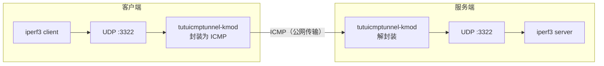

# 使用 iperf3 测试 tutuicmptunnel-kmod 隧道性能

[English](./iperf3.md) | [简体中文](./iperf3_zh-CN.md)

---

本文演示如何用 `ktuctl` 在客户端与服务器之间搭建一条 UDP-over-ICMP 隧道，并通过 `iperf3` 进行 UDP 吞吐测试，验证隧道的带宽、丢包率与抖动表现。



## 前提条件

* 客户端与服务器均已安装 `tutuicmptunnel-kmod`，且内核模块可正常加载
* 服务器已配置 SSH 免密登录（部署脚本需要通过 `ssh` 在服务器上执行命令）
* 两端已安装 `iperf3`

本文使用的示例参数如下，请按实际环境替换：

| 参数 | 示例值 | 说明 |
| :--- | :--- | :--- |
| 服务器主机名 | `a320` | 已配置 SSH 免密登录 |
| 隧道 UDP 端口 | `3322` | iperf3 监听与测试端口 |
| 隧道 UID | `99` | 两端 `uids` 文件中已登记 |
| 服务器物理网卡 | `enp4s0` | 服务器出口网卡 |
| 客户端物理网卡 | `wlan0` | 客户端出口网卡 |

> [!WARNING]
> 部署脚本会执行 `rmmod` / `modprobe` 重新加载内核模块，**这会清空该端已有的全部隧道规则**。如果机器上还有其他正在使用的隧道，请先备份规则或改用 `ktuctl script` 增量添加。

## 部署隧道

将以下脚本保存到客户端，命名为 `run_tunnel.sh`：

```bash
#!/bin/sh
set -e

HOST=a320                    # 服务器主机或 IP
PORT=3322                    # 隧道 UDP 端口
HOST_DEV=enp4s0              # 服务器出口网卡名

UID=99
LOCAL=192.168.15.238         # 客户端自己的地址
LOCAL_DEV=wlan0              # 客户端出口网卡名
COMMENT=r7735h               # 备注，可随意

# -------- 服务器端 --------
ssh $HOST sudo rmmod tutuicmptunnel
ssh $HOST sudo modprobe tutuicmptunnel
ssh $HOST sudo ktuctl server
ssh $HOST sudo ktuctl server-add uid $UID address $LOCAL port $PORT comment $COMMENT

# -------- 客户端 --------
sudo rmmod tutuicmptunnel
sudo modprobe tutuicmptunnel
cat << EOF | sudo ktuctl script -
client
client-add uid $UID address $HOST port $PORT
EOF
```

执行：

```bash
chmod +x run_tunnel.sh
./run_tunnel.sh
```

脚本会在两端分别重载内核模块并写入隧道规则：服务器端添加指向客户端的规则，客户端添加指向服务器的规则。

## 测速

**服务器侧启动 iperf3 服务端：**

```bash
ssh a320 "iperf3 -s -p 3322"
```

**客户端侧发起下行 UDP 测试**（时长 1 小时，报文长度 1472 B，目标带宽 1 Gbps）：

```bash
iperf3 -c a320 -p 3322 -u -b 1000m -t 3600 -l 1472 -R
```

> [!NOTE]
> `-R` 表示反向（下行）测试，即服务器发送、客户端接收。去掉 `-R` 即为上行测试。

**观察结果：**

* `iperf3` 客户端/服务器的输出即为隧道实测的带宽、丢包率、抖动
* 在两端另开终端执行 `sudo ktuctl status -d`，可查看隧道处理 / 丢弃 / GSO 等计数器

## 清理

```bash
# 客户端
sudo rmmod tutuicmptunnel

# 服务器
ssh a320 sudo rmmod tutuicmptunnel
```

至此完成一次基于 ICMP 隧道的 `iperf3` 吞吐测试。
