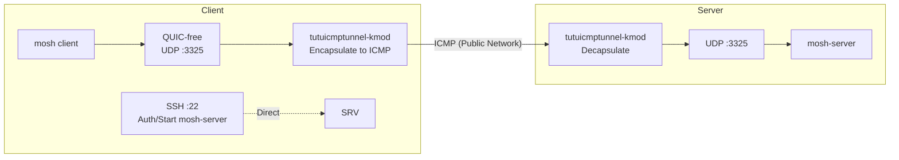

# Protecting mosh Traffic with tutuicmptunnel-kmod

[English](./mosh.md) | [简体中文](./mosh_zh-CN.md)

---

`mosh` uses UDP for interactive data, which can cause lag or even complete unavailability in networks where UDP is blocked or QoS throttled. This document demonstrates how to fix mosh's UDP session port to a single port (using `3325/udp` as an example) and use `tutuicmptunnel-kmod` to encapsulate that port's UDP traffic into ICMP echo request/reply for transmission, keeping mosh usable in adverse network conditions.



## Background

1. **mosh is not pure SSH**

   When mosh starts, it first uses SSH for authentication and to start the server process. After that, the actual interactive data uses UDP. Therefore, the SSH connection itself does not need to go through the tunnel, only the UDP session port needs to be encapsulated.

2. **Server must have `mosh-server` process**

   The mosh client executes `mosh-server new ...` via SSH on the remote end to start a UDP session endpoint.

3. **Fixed port simplifies tunnel encapsulation**

   mosh defaults to selecting a port from a range (commonly 60000–61000). For ICMP tunnels, fixing to a single port (or small range) makes rules simpler and operation more stable. This tutorial uses `mosh-server new -p 3325:3325` to fix the port to `3325`.

## Prerequisites

| Parameter | Example Value | Description |
| :--- | :--- | :--- |
| Server address | `test.server` | mosh server domain or IP |
| mosh UDP port | `3325` | Fixed session port |
| tuctl_server port | `14801` | Remote management port |
| tuctl_server PSK | `yourlongpsk` | Remote management passphrase |
| Client UID | `199` | Unique UID assigned to this client on the server |

> [!NOTE]
> The above are example values, please replace according to your actual situation. The server needs to have `tutuicmptunnel-tuctl-server` service installed and running, and the UID must be registered in both server and client's `/etc/tutuicmptunnel/uids` (see the "Assign UID" section in [wireguard tutorial](/docs/wireguard.md)).

## Server Configuration

1. Install mosh:

```bash
# Debian/Ubuntu
sudo apt update && sudo apt install -y mosh
```

2. Allow UDP 3325 (if firewall is enabled):

```bash
sudo ufw allow 3325/udp
```

## Client Configuration

Save the following script as `mosh-over-icmp.sh`:

```bash
#!/usr/bin/env bash
set -euo pipefail

ADDRESS="test.server"
PORT="3325"
TUTU_UID="199"
SERVER_PORT="14801"
COMMENT="a320-mosh"
PSK="yourlongpsk"

# Configure according to your server settings
#export TUTUICMPTUNNEL_PWHASH_MEMLIMIT="1024768"

MOSH_USER="${MOSH_USER:-$USER}"
SSH_PORT="${SSH_PORT:-22}"

sudo ktuctl client
sudo ktuctl client-del uid "$TUTU_UID" address "$ADDRESS"
sudo ktuctl client-add uid "$TUTU_UID" address "$ADDRESS" port "$PORT"
sudo ktuctl status

tuctl_client psk "$PSK" server "$ADDRESS" server-port "$SERVER_PORT" \
  <<< "server-add uid $TUTU_UID address @client_ip@ port $PORT comment $COMMENT"

if [[ "$SSH_PORT" == "22" ]]; then
  exec mosh --server="mosh-server new -p ${PORT}:${PORT}" \
    "${MOSH_USER}@${ADDRESS}"
else
  exec mosh --ssh="ssh -p ${SSH_PORT}" \
    --server="mosh-server new -p ${PORT}:${PORT}" \
    "${MOSH_USER}@${ADDRESS}"
fi
```

The script does three things: registers client rules locally with `ktuctl`, remotely notifies the server to add rules via `tuctl_client`, then starts mosh with a fixed port.

## Start

```bash
chmod +x mosh-over-icmp.sh
./mosh-over-icmp.sh
```

Specify login username or custom SSH port:

```bash
MOSH_USER=root SSH_PORT=2222 ./mosh-over-icmp.sh
```

## Verification

**Check UDP listening on server:**

```bash
sudo ss -lunp | grep ':3325'
```

**Packet capture on client to confirm traffic is encapsulated as ICMP:**

```bash
sudo tcpdump -ni any icmp
```

> [!TIP]
> If mosh connection disconnects immediately after establishing, first check if the UID in the `uids` files on both ends is consistent, and whether the server firewall has allowed the corresponding port.