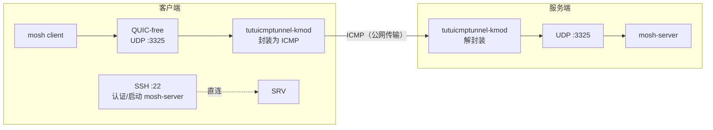

# 使用 tutuicmptunnel-kmod 保护 mosh 流量

[English](./mosh.md) | [简体中文](./mosh_zh-CN.md)

---

`mosh` 的交互数据走 UDP，在 UDP 被封锁或 QoS 限速的网络中会出现卡顿甚至完全不可用。本文演示如何将 mosh 的 UDP 会话端口固定为单个端口（以 `3325/udp` 为例），并用 `tutuicmptunnel-kmod` 将该端口的 UDP 流量封装进 ICMP echo request/reply 传输，从而在恶劣网络环境中保持 mosh 可用。



## 背景原理

1. **mosh 不是纯 SSH**

   mosh 启动时先走 SSH 完成认证并启动服务端进程，随后真正的交互数据走 UDP。因此 SSH 连接本身无需也不应走隧道，只有 UDP 会话端口需要封装。

2. **服务端必须有 `mosh-server` 进程**

   mosh 客户端会通过 SSH 在远端执行 `mosh-server new ...`，启动一个 UDP 会话端点。

3. **固定端口便于隧道封装**

   mosh 默认在一个端口范围内挑选端口（常见 60000–61000）。对 ICMP 隧道来说，固定为单端口（或小范围）规则更简单、运行更稳定。本教程通过 `mosh-server new -p 3325:3325` 将端口固定为 `3325`。

## 前提条件

| 参数 | 示例值 | 说明 |
| :--- | :--- | :--- |
| 服务器地址 | `test.server` | mosh 服务器域名或 IP |
| mosh UDP 端口 | `3325` | 固定会话端口 |
| tuctl_server 端口 | `14801` | 远程管理端口 |
| tuctl_server PSK | `yourlongpsk` | 远程管理口令 |
| 客户端 UID | `199` | 在服务器上为该客户端分配的唯一 UID |

> [!NOTE]
> 以上均为示例值，请按实际情况替换。服务器端需已安装并运行 `tutuicmptunnel-tuctl-server` 服务，且服务器与客户端的 `/etc/tutuicmptunnel/uids` 中均已登记该 UID（参见 [wireguard 教程](/docs/wireguard_zh-CN.md) 的「分配 UID」一节）。

## 服务端配置

1. 安装 mosh：

```bash
# Debian/Ubuntu
sudo apt update && sudo apt install -y mosh
```

2. 放行 UDP 3325（如有防火墙）：

```bash
sudo ufw allow 3325/udp
```

## 客户端配置

将以下脚本保存为 `mosh-over-icmp.sh`：

```bash
#!/usr/bin/env bash
set -euo pipefail

ADDRESS="test.server"
PORT="3325"
TUTU_UID="199"
SERVER_PORT="14801"
COMMENT="a320-mosh"
PSK="yourlongpsk"

# 按照你的服务器设置
#export TUTUICMPTUNNEL_PWHASH_MEMLIMIT="1048576"

MOSH_USER="${MOSH_USER:-$USER}"
SSH_PORT="${SSH_PORT:-22}"

sudo ktuctl client
sudo ktuctl client-del uid "$TUTU_UID" address "$ADDRESS"
sudo ktuctl client-add uid "$TUTU_UID" address "$ADDRESS" port "$PORT"
sudo ktuctl status

tuctl_client psk "$PSK" server "$ADDRESS" server-port "$SERVER_PORT" \
  <<< "server-add uid $TUTU_UID address @client_ip@ port $PORT comment $COMMENT"

if [[ "$SSH_PORT" == "22" ]]; then
  exec mosh --server="mosh-server new -p ${PORT}:${PORT}" \
    "${MOSH_USER}@${ADDRESS}"
else
  exec mosh --ssh="ssh -p ${SSH_PORT}" \
    --server="mosh-server new -p ${PORT}:${PORT}" \
    "${MOSH_USER}@${ADDRESS}"
fi
```

脚本做了三件事：在本地 `ktuctl` 注册客户端规则、通过 `tuctl_client` 远程通知服务器添加规则、然后以固定端口启动 mosh。

## 启动

```bash
chmod +x mosh-over-icmp.sh
./mosh-over-icmp.sh
```

指定登录用户名或自定义 SSH 端口：

```bash
MOSH_USER=root SSH_PORT=2222 ./mosh-over-icmp.sh
```

## 验证

**服务端查看 UDP 监听：**

```bash
sudo ss -lunp | grep ':3325'
```

**客户端抓包确认流量已封装为 ICMP：**

```bash
sudo tcpdump -ni any icmp
```

> [!TIP]
> 如果 mosh 连接建立后立即断开，先检查两端 `uids` 文件中的 UID 是否一致，以及服务器防火墙是否放行了对应端口。
