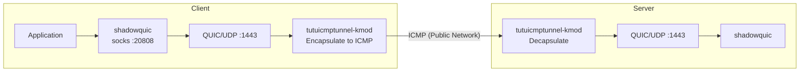

# Protecting shadowquic Traffic with tutuicmptunnel-kmod

[English](./shadowquic.md) | [简体中文](./shadowquic_zh-CN.md)

---

`shadowquic` is a proxy tool based on **Rust** and **quinn (QUIC)**, with a design philosophy similar to Hysteria: achieving higher throughput and better weak network performance through **UDP/QUIC** transport. Combined with `tutuicmptunnel-kmod`, you can encapsulate QUIC's UDP traffic into ICMP packets for transmission, bypassing QoS throttling and interference targeting UDP.

> [!IMPORTANT]
> Please use shadowquic **version 0.3.3 or newer**. Older versions do not support disabling **GSO** and cannot work properly with `tutuicmptunnel-kmod`.



## Features and Advantages

1. **Fast speed, low resource usage**

   In the author's test environment (mipsle, Xiaomi R3G router), `shadowquic` memory usage is about 1/3 of `hysteria`, and CPU usage under high load is only about 50%.

2. **Based on JLS, certificate-free deployment**

   `shadowquic` uses JLS — a TLS 1.3-style handshake obfuscation and authentication scheme that relies on shared credentials between both parties rather than traditional certificate infrastructure. Therefore, deployment does not require ACME certificate application or self-built certificate chains like `hysteria`.

   * The `server-name` in client configuration is used for handshake appearance/fingerprint alignment
   * Generally needs to match the server's `jls_upstream`

3. **Memory safety from Rust**

   Rust eliminates common memory safety issues found in traditional C/C++ at the language level.

## Installation and Configuration

### Server

Install and start the service:

```bash
curl -L https://raw.githubusercontent.com/spongebob888/shadowquic/main/scripts/linux_install.sh | bash
systemctl daemon-reload
systemctl enable --now shadowquic.service
```

#### Disable GSO (Required)

To work with `tutuicmptunnel-kmod`, edit `/etc/shadowquic/server.yaml` and add (or confirm it exists) under `inbound`:

```yaml
inbound:
  ...
  gso: false
```

Then restart the service:

```bash
systemctl restart shadowquic.service
```

### Client

Fill in the username and password generated by the server installation script into `client.yaml`, and also **disable GSO**:

```yaml
inbound:
  type: socks
  bind-addr: "127.0.0.1:20808"

outbound:
  type: shadowquic
  addr: "1.2.3.4:1443"
  username: "username"           # Username
  password: "password"           # Password
  server-name: "cloudflare.com"  # Usually needs to match server's jls_upstream for appearance/fingerprint alignment
  alpn: ["h3"]
  initial-mtu: 1000
  congestion-control: bbr
  zero-rtt: true
  gso: false                     # Required for tutuicmptunnel-kmod, must be disabled
  over-stream: false             # true: UDP over stream；false: UDP over datagram

log-level: "info"
```

Start the client:

```bash
shadowquic -c client.yaml
```

## Integrating tutuicmptunnel-kmod

After the client is running normally, you can use `tutuicmptunnel-kmod` to encapsulate and protect the traffic. The configuration method is basically the same as the [hysteria tutorial](/docs/hysteria.md), just change the port to `1443`.