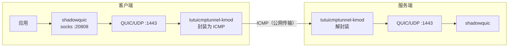

# 使用 tutuicmptunnel-kmod 保护 shadowquic 流量

[English](./shadowquic.md) | [简体中文](./shadowquic_zh-CN.md)

---

`shadowquic` 是一个基于 **Rust** 与 **quinn（QUIC）** 的代理工具，设计思路与 Hysteria 类似：通过 **UDP/QUIC** 传输获得更高的吞吐量和更好的弱网表现。配合 `tutuicmptunnel-kmod`，可以将 QUIC 的 UDP 流量封装进 ICMP 报文传输，绕过针对 UDP 的 QoS 限速与干扰。

> [!IMPORTANT]
> 请使用 shadowquic **0.3.3 或更新版本**。旧版本不支持关闭 **GSO**，无法与 `tutuicmptunnel-kmod` 正常配合。



## 特点与优势

1. **速度快，资源占用低**

   在笔者的测试环境（mipsle，小米 R3G 路由器）中，`shadowquic` 的内存占用约为 `hysteria` 的 1/3，高负载时 CPU 占用仅 50% 左右。

2. **基于 JLS，免证书部署**

   `shadowquic` 采用 JLS——一种 TLS 1.3 风格的握手伪装与认证方案，依赖双方共享凭据而非传统证书体系。因此部署时无需像 `hysteria` 那样通过 ACME 申请证书或自建证书链。

   * 客户端配置中的 `server-name` 用于握手外观/指纹对齐
   * 一般需要与服务端的 `jls_upstream` 保持一致

3. **Rust 带来的内存安全**

   Rust 从语言层面消除了传统 C/C++ 中常见的内存安全隐患。

## 安装与配置

### 服务端

安装并启动服务：

```bash
curl -L https://raw.githubusercontent.com/spongebob888/shadowquic/main/scripts/linux_install.sh | bash
systemctl daemon-reload
systemctl enable --now shadowquic.service
```

#### 关闭 GSO（必须）

为配合 `tutuicmptunnel-kmod`，编辑 `/etc/shadowquic/server.yaml`，在 `inbound` 下添加（或确认存在）：

```yaml
inbound:
  ...
  gso: false
```

然后重启服务：

```bash
systemctl restart shadowquic.service
```

### 客户端

将服务端安装脚本生成的用户名和密码填入 `client.yaml`，并同样**关闭 GSO**：

```yaml
inbound:
  type: socks
  bind-addr: "127.0.0.1:20808"

outbound:
  type: shadowquic
  addr: "1.2.3.4:1443"
  username: "username"           # 用户名
  password: "password"           # 密码
  server-name: "cloudflare.com"  # 通常需与服务端 jls_upstream 一致，用于外观/指纹对齐
  alpn: ["h3"]
  initial-mtu: 1000
  congestion-control: bbr
  zero-rtt: true
  gso: false                     # 配合 tutuicmptunnel-kmod，必须关闭
  over-stream: false             # true: UDP over stream；false: UDP over datagram

log-level: "info"
```

启动客户端：

```bash
shadowquic -c client.yaml
```

## 接入 tutuicmptunnel-kmod

客户端正常运行后，即可用 `tutuicmptunnel-kmod` 对流量进行封装保护。配置方法与 [hysteria 教程](/docs/hysteria_zh-CN.md) 基本相同，只需将端口改为 `1443`。
