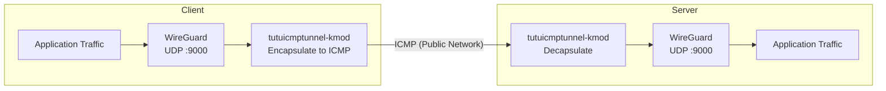

# Protecting WireGuard Traffic with tutuicmptunnel-kmod

[English](./wireguard.md) | [简体中文](./wireguard_zh-CN.md)

---

`WireGuard` is an efficient, modern VPN protocol based on `UDP`. However, in some network environments, ISPs may apply QoS throttling or even interference to `UDP` traffic, causing WireGuard performance degradation or connection instability.

`tutuicmptunnel-kmod` can encapsulate WireGuard's UDP traffic into ICMP packets for transmission, bypassing UDP-specific throttling and interference.



## Prerequisites

This tutorial assumes you already have a working WireGuard configuration `/etc/wireguard/myserver.conf`, and now we'll modify it to enable tutuicmptunnel-kmod encapsulation.

The parameters used in the example are as follows:

| Parameter | Value |
| :--- | :--- |
| WireGuard server port | `9000` |
| Server address | `myserver.ip` |
| tuctl_server port | `9010` |
| tuctl_server PSK passphrase | `verylongpsk` |

> [!NOTE]
> Please replace the above parameters according to your actual situation. The server needs to have the `tutuicmptunnel-tuctl-server` system service installed and running, so the client can remotely manage server rules via `tuctl_client`.

## Deployment

### 1. Assign UID

Select a unique `uid` and hostname for each client device. In this example, we use `uid = 100` and hostname `a320`.

Add a line to the `/etc/tutuicmptunnel/uids` file on **both server and client**:

```text
100 a320
```

### 2. Create Environment Variable File

> [!IMPORTANT]
> The following operations are performed on the **client**.

Create `/etc/wireguard/tutuicmptunnel.myserver` with the following content:

```sh
#!/bin/sh

TUTU_UID=a320
ADDR=myserver.ip
PORT=9000
SERVER_PORT=9010
PSK=verylongpsk
COMMENT=myserver-wgserver
```

### 3. Configure WireGuard Hooks

Add the following hooks to the `[Interface]` section of the WireGuard configuration `/etc/wireguard/myserver.conf` to enable automatic rule management when the interface starts and stops:

```ini
[Interface]
# Before interface startup: add local client rules
PreUp = env_file=$(dirname $CONFIG_FILE)/tutuicmptunnel.myserver; source $env_file && ktuctl client-add user $TUTU_UID address $ADDR port $PORT comment $COMMENT || true
# Before interface startup: remotely add server rules via tuctl_client
PreUp = env_file=$(dirname $CONFIG_FILE)/tutuicmptunnel.myserver; source $env_file && tuctl_client server $ADDR server-port $SERVER_PORT psk $PSK <<< "server-add user $TUTU_UID comment $COMMENT address @client_ip@ port $PORT" || true
# After interface shutdown: delete local client rules
PostDown = env_file=$(dirname $CONFIG_FILE)/tutuicmptunnel.myserver; source $env_file && ktuctl client-del user $TUTU_UID address $ADDR || true
# After interface shutdown: remotely delete server rules
PostDown = env_file=$(dirname $CONFIG_FILE)/tutuicmptunnel.myserver; source $env_file && tuctl_client server $ADDR server-port $SERVER_PORT psk $PSK <<< "server-del user $TUTU_UID" || true
```

After configuration, when the `myserver` interface starts, it will automatically add encapsulation rules on both client and server sides, and automatically clean up when shut down.

### 4. Restart Interface

Use `wg-quick` to restart the interface to apply the configuration:

```bash
sudo wg-quick down myserver
sudo wg-quick up myserver
```

## Troubleshooting

To observe ICMP encapsulated traffic, you can capture packets to confirm:

```bash
sudo tcpdump -i any -n icmp -v
```

> [!TIP]
> Enabling BBR congestion control algorithm in the kernel (`net.ipv4.tcp_congestion_control=bbr`) can significantly improve WireGuard performance.