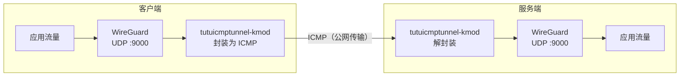

# 使用 tutuicmptunnel-kmod 保护 WireGuard 流量

[English](./wireguard.md) | [简体中文](./wireguard_zh-CN.md)

---

`WireGuard` 是一个高效、现代的基于 `UDP` 的 VPN 协议。但在某些网络环境中，ISP 会对 `UDP` 流量进行 QoS 限速甚至干扰，导致 WireGuard 性能下降或连接不稳定。

`tutuicmptunnel-kmod` 可以将 WireGuard 的 UDP 流量封装进 ICMP 报文中传输，从而绕过针对 UDP 的限速和干扰。



## 前提条件

本教程假设你已经有一份可用的 WireGuard 配置 `/etc/wireguard/myserver.conf`，现在对它进行改造，以启用 tutuicmptunnel-kmod 封装。

示例中使用的参数如下：

| 参数 | 值 |
| :--- | :--- |
| WireGuard 服务端端口 | `9000` |
| 服务器地址 | `myserver.ip` |
| tuctl_server 端口 | `9010` |
| tuctl_server PSK 口令 | `verylongpsk` |

> [!NOTE]
> 请根据实际情况替换上述参数。服务器端需要已经安装并运行 `tutuicmptunnel-tuctl-server` 系统服务，以便客户端通过 `tuctl_client` 远程管理服务器规则。

## 部署

### 1. 分配 UID

为每台客户端设备选择一个唯一的 `uid` 和主机名。本例中使用 `uid = 100`，主机名为 `a320`。

在**服务器和客户端**的 `/etc/tutuicmptunnel/uids` 文件中分别添加一行：

```text
100 a320
```

### 2. 创建环境变量文件

> [!IMPORTANT]
> 以下操作均在**客户端**上执行。

创建 `/etc/wireguard/tutuicmptunnel.myserver`，内容如下：

```sh
#!/bin/sh

TUTU_UID=a320
ADDR=myserver.ip
PORT=9000
SERVER_PORT=9010
PSK=verylongpsk
COMMENT=myserver-wgserver
```

### 3. 配置 WireGuard 钩子

在 WireGuard 配置 `/etc/wireguard/myserver.conf` 的 `[Interface]` 段中添加以下钩子，实现接口启停时的规则自动管理：

```ini
[Interface]
# 接口启动前：添加本地客户端规则
PreUp = env_file=$(dirname $CONFIG_FILE)/tutuicmptunnel.myserver; source $env_file && ktuctl client-add user $TUTU_UID address $ADDR port $PORT comment $COMMENT || true
# 接口启动前：通过 tuctl_client 远程添加服务器规则
PreUp = env_file=$(dirname $CONFIG_FILE)/tutuicmptunnel.myserver; source $env_file && tuctl_client server $ADDR server-port $SERVER_PORT psk $PSK <<< "server-add user $TUTU_UID comment $COMMENT address @client_ip@ port $PORT" || true
# 接口关闭后：删除本地客户端规则
PostDown = env_file=$(dirname $CONFIG_FILE)/tutuicmptunnel.myserver; source $env_file && ktuctl client-del user $TUTU_UID address $ADDR || true
# 接口关闭后：远程删除服务器规则
PostDown = env_file=$(dirname $CONFIG_FILE)/tutuicmptunnel.myserver; source $env_file && tuctl_client server $ADDR server-port $SERVER_PORT psk $PSK <<< "server-del user $TUTU_UID" || true
```

配置完成后，`myserver` 接口启动时会自动在客户端和服务器两侧添加封装规则，关闭时自动清理。

### 4. 重启接口

使用 `wg-quick` 重启接口使配置生效：

```bash
sudo wg-quick down myserver
sudo wg-quick up myserver
```

## 故障排查

如需观察 ICMP 封装流量，可以抓包确认：

```bash
sudo tcpdump -i any -n icmp -v
```

> [!TIP]
> 在内核中启用 BBR 拥塞控制算法（`net.ipv4.tcp_congestion_control=bbr`）可以显著提升 WireGuard 的性能。
