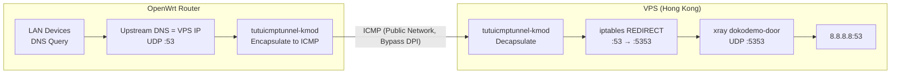

# Protecting DNS Queries with tutuicmptunnel-kmod (xray + OpenWrt)

[English](./xray_dns.md) | [简体中文](./xray_dns_zh-CN.md)

---

Forward DNS queries on VPS to 8.8.8.8 via xray-core's dokodemo-door, and use tutuicmptunnel-kmod on OpenWrt side to encapsulate UDP queries into ICMP, reducing DPI interference and pollution probability. On VPS, redirect external 53/UDP to local 5353/UDP via iptables to avoid systemd-resolved port occupation.



## Overall Approach

* Choose a Hong Kong VPS (EDNS routing is closer to domestic, lower latency)
* Use xray-core on VPS to open 5353/UDP dokodemo-door, forwarding to 8.8.8.8:53
* Use iptables on VPS to redirect eth0's 53/UDP to 5353/UDP
* Use tutuicmptunnel-kmod on OpenWrt to encapsulate outgoing DNS UDP into ICMP for forwarding, bypassing GFW's DPI
* Use hotplug scripts on OpenWrt WAN interface up/down to automatically establish/tear down tunnel
* Finally configure upstream DNS in OpenWrt as VPS IP

## VPS Configuration

### 1. Configure xray-core

Add a dokodemo-door Inbound in server configuration, listening on 5353/UDP and forwarding to 8.8.8.8:53:

```json
        {
            "port": 5353,
            "protocol": "dokodemo-door",
            "settings": {
                "address": "8.8.8.8",
                "port": 53,
                "network": "udp"
            },
            "tag": "dns-in"
        },
```

> [!NOTE]
> * Using 5353 avoids conflict with systemd-resolved's port 53.
> * This Inbound only handles UDP.

Restart service:

```bash
sudo systemctl restart xray
```

### 2. Configure Port Redirection (iptables)

> [!WARNING]
> This configuration will make the VPS's public 53/UDP appear as an **open DNS recursive resolver** when the tunnel is not established — anyone `dig @yourVPS` will get a response. Many VPS providers explicitly prohibit open port 53 (to prevent DNS amplification attack abuse), which may trigger abuse warnings or even shutdown. If your provider has this restriction, or you prefer a more stable approach, please use the "[Alternative: Use Non-standard Port Directly](#alternative-use-non-standard-port-directly)" method below.

Redirect UDP 53 from eth0 to local UDP 5353 (insert at the top of the rule chain to avoid being matched by other rules first):

```bash
sudo iptables -t nat -I PREROUTING 1 -i eth0 -p udp --dport 53 -j REDIRECT --to-ports 5353
```

Persist (Debian/Ubuntu):

```bash
sudo apt-get install -y iptables-persistent
sudo netfilter-persistent save
```

Verify rules:

```bash
sudo iptables -t nat -L -v -n
```

### 3. Verify Resolution (and Current Pollution Status)

Test resolution from external machine:

```bash
dig reddit.com @your_vps_ip
```

```text
;; ->>HEADER<<- opcode: QUERY, rcode: NOERROR, id: 44623
;; flags: qr rd ra ; QUERY: 1, ANSWER: 4, AUTHORITY: 0, ADDITIONAL: 0
;; QUESTION SECTION:
;; reddit.com.    IN    A

;; ANSWER SECTION:
reddit.com.    192    IN    A    151.101.193.140
reddit.com.    192    IN    A    151.101.1.140
reddit.com.    192    IN    A    151.101.65.140
reddit.com.    192    IN    A    151.101.129.140

;; Query time: 80 msec
;; MSG SIZE  rcvd: 92
```

But don't celebrate too early — the query is still using plaintext UDP at this point, and GFW's DPI can still pollute the results:

```bash
dig www.google.com @your_vps_ip
```

```text
;; ->>HEADER<<- opcode: QUERY, rcode: NOERROR, id: 62391
;; flags: qr rd ra ; QUERY: 1, ANSWER: 1, AUTHORITY: 0, ADDITIONAL: 0
;; QUESTION SECTION:
;; www.google.com.    IN    A

;; ANSWER SECTION:
www.google.com.    141    IN    A    31.13.88.26

;; Query time: 51 msec
;; MSG SIZE  rcvd: 48
```

The returned `31.13.88.26` is a polluted result. Next, use tutuicmptunnel-kmod to solve this step.

### Alternative: Use Non-standard Port Directly

A more stable approach is to **completely avoid exposing port 53 on the public network**: let xray listen directly on a non-standard port (like 5353), and the client tunnel also forwards directly to that port, eliminating the iptables redirect step:

1. xray configuration remains unchanged (dokodemo-door listening on 5353/UDP)
2. **Skip** the iptables REDIRECT configuration above
3. Change `PORT` in OpenWrt hotplug script to `5353`
4. Configure OpenWrt upstream DNS as `VPS_IP#5353` (dnsmasq supports `server=x.x.x.x#5353` format to specify port)

Since tutuicmptunnel-kmod encapsulates traffic into ICMP packets on the public network, UDP ports are not externally visible at all. In this approach, the VPS has no open resolver exposure.

## OpenWrt Configuration

### 1. Register UID

Add corresponding UID in both server and client's `/etc/tutuicmptunnel/uids`:

```text
116 yourname-dns
```

### 2. Configure Hotplug Script

Use hotplug to create tunnel when WAN interface is up and clean up when down. Please replace the real values in the script (`HOST`, `PSK`, `UID_`, etc.).

`/etc/hotplug.d/iface/95-wan-up`:

```bash
#!/bin/sh

[ "$ACTION" = "ifup" ] || exit 0
[ "$INTERFACE" = "wan" ] || exit 0

logger "Starting WAN custom script"

UID_=yourname-dns
HOST=x.x.x.x
PSK=yourpsk
PORT=53
#export TUTUICMPTUNNEL_PWHASH_MEMLIMIT=1048576 # According to your tuserver setting

V() {
  echo "$@"
  "$@"
}

ktuctl client-del $UID_ address $HOST
ktuctl client-add uid $UID_ address $HOST port $PORT comment your-vps-name-dns
echo "server-add uid $UID_ address @client_ip@ port $PORT comment yourname-dns" | V tuctl_client server $HOST server-port 14801 psk $PSK
```

`/etc/hotplug.d/iface/95-wan-down`:

```bash
#!/bin/sh

[ "$ACTION" = "ifdown" ] || exit 0
[ "$INTERFACE" = "wan" ] || exit 0

logger "Closing WAN custom script"

UID_=yourname-dns
HOST=x.x.x.x
PSK=yourpsk
PORT=53
COMMENT=yourname-dns
#export TUTUICMPTUNNEL_PWHASH_MEMLIMIT=1048576 # According to your tuserver setting

V() {
  echo "$@"
  "$@"
}

ktuctl client-del uid $UID_ address $HOST
echo "server-del uid $UID_" | V tuctl_client server $HOST server-port 14801 psk $PSK
```

> [!NOTE]
> * `UID_` is used to identify this tunnel instance, needs to be consistent on both ends
> * `HOST` is your VPS public IP, `PSK` is the pre-shared key
> * `tuctl_client` / `ktuctl` commands and port `14801` should match your actual deployment
> * tutuicmptunnel-kmod completes UDP→ICMP conversion before netfilter, won't conflict with iptables REDIRECT
> * Ensure OpenWrt and VPS time are synchronized to avoid key/session-based mechanism failures

### 3. Enable Tunnel

Restart WAN interface to trigger hotplug script to establish tunnel:

```bash
ifdown wan; ifup wan
```

## Verification

Test resolution again:

```bash
dig reddit.com @your_vps_ip
```

```text
;; ->>HEADER<<- opcode: QUERY, rcode: NOERROR, id: 44623
;; flags: qr rd ra ; QUERY: 1, ANSWER: 4, AUTHORITY: 0, ADDITIONAL: 0
;; QUESTION SECTION:
;; reddit.com.    IN    A

;; ANSWER SECTION:
reddit.com.    192    IN    A    151.101.193.140
reddit.com.    192    IN    A    151.101.1.140
reddit.com.    192    IN    A    151.101.65.140
reddit.com.    192    IN    A    151.101.129.140

;; Query time: 80 msec
;; MSG SIZE  rcvd: 92
```

If the returned IP matches the global public resolution result, it indicates that pollution has been significantly mitigated. Finally, in OpenWrt's network interface or DHCP/DNS configuration, set the primary DNS to your VPS IP (i.e., `HOST`).

## Summary

* **xray-core**: Forward DNS queries entering VPS on 53/UDP to stable public DNS
* **iptables**: Redirect external requests on port 53 to xray's 5353, avoiding port conflicts
* **tutuicmptunnel-kmod**: Encapsulate UDP queries into ICMP on OpenWrt side, effectively reducing DPI pollution
* **Hotplug scripts**: Automatically manage tunnel with WAN interface, the overall process works stably on both home broadband and mobile networks

> [!WARNING]
> When using iptables REDIRECT approach, VPS public port 53 is an open resolver. Some VPS providers prohibit open port 53. If concerned, please use the "[Alternative: Use Non-standard Port Directly](#alternative-use-non-standard-port-directly)" approach.