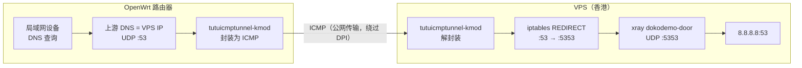

# 使用 tutuicmptunnel-kmod 保护 DNS 查询（xray + OpenWrt）

[English](./xray_dns.md) | [简体中文](./xray_dns_zh-CN.md)

---

将 VPS 上的 DNS 查询通过 xray-core 的 dokodemo-door 转发到 8.8.8.8，并在 OpenWrt 侧用 tutuicmptunnel-kmod 将 UDP 查询封装为 ICMP，降低 DPI 干扰与污染的概率。VPS 上通过 iptables 将对外的 53/UDP 重定向到本机 5353/UDP，避开 systemd-resolved 的端口占用。



## 整体思路

* 选一台香港 VPS（EDNS 选路更接近国内，延迟较低）
* VPS 上用 xray-core 开 5353/UDP dokodemo-door，转发到 8.8.8.8:53
* VPS 上用 iptables 将 eth0 的 53/UDP 重定向到 5353/UDP
* OpenWrt 上使用 tutuicmptunnel-kmod，将外发 DNS 的 UDP 封装为 ICMP 转发，绕开 GFW 的 DPI
* OpenWrt 的 WAN 接口 up/down 时通过 hotplug 脚本自动建立/拆除隧道
* 最后在 OpenWrt 中将上游 DNS 配置为 VPS IP

## VPS 端配置

### 1. 配置 xray-core

在服务端配置中添加一个 dokodemo-door Inbound，监听 5353/UDP 并转发到 8.8.8.8:53：

```json
        {
            "port": 5353,
            "protocol": "dokodemo-door",
            "settings": {
                "address": "8.8.8.8",
                "port": 53,
                "network": "udp"
            },
            "tag": "dns-in"
        },
```

> [!NOTE]
> * 使用 5353 是为了避免与 systemd-resolved 占用的 53 端口冲突。
> * 该 Inbound 仅处理 UDP。

重启服务：

```bash
sudo systemctl restart xray
```

### 2. 配置端口重定向（iptables）

> [!WARNING]
> 此配置会让 VPS 的公网 53/UDP 在隧道未建立时表现为**开放 DNS 递归解析器**（open resolver）——任何人 `dig @你的VPS` 都能得到应答。许多 VPS 服务商明确禁止开放 53 端口（防 DNS 放大攻击滥用），可能触发 abuse 警告甚至停机。如果你的服务商有此限制，或你希望更稳妥，请改用下文「[备选：直接使用非标准端口](#备选直接使用非标准端口)」的方案。

将来自 eth0 的 UDP 53 重定向到本机 UDP 5353（插到规则链最前，避免被其他规则抢先匹配）：

```bash
sudo iptables -t nat -I PREROUTING 1 -i eth0 -p udp --dport 53 -j REDIRECT --to-ports 5353
```

持久化（Debian/Ubuntu）：

```bash
sudo apt-get install -y iptables-persistent
sudo netfilter-persistent save
```

验证规则：

```bash
sudo iptables -t nat -L -v -n
```

### 3. 验证解析（及污染现状）

从外部机器测试解析：

```bash
dig reddit.com @your_vps_ip
```

```text
;; ->>HEADER<<- opcode: QUERY, rcode: NOERROR, id: 44623
;; flags: qr rd ra ; QUERY: 1, ANSWER: 4, AUTHORITY: 0, ADDITIONAL: 0
;; QUESTION SECTION:
;; reddit.com.    IN    A

;; ANSWER SECTION:
reddit.com.    192    IN    A    151.101.193.140
reddit.com.    192    IN    A    151.101.1.140
reddit.com.    192    IN    A    151.101.65.140
reddit.com.    192    IN    A    151.101.129.140

;; Query time: 80 msec
;; MSG SIZE  rcvd: 92
```

但先别高兴太早——此时查询走的仍是明文 UDP，GFW 的 DPI 仍然可以污染结果：

```bash
dig www.google.com @your_vps_ip
```

```text
;; ->>HEADER<<- opcode: QUERY, rcode: NOERROR, id: 62391
;; flags: qr rd ra ; QUERY: 1, ANSWER: 1, AUTHORITY: 0, ADDITIONAL: 0
;; QUESTION SECTION:
;; www.google.com.    IN    A

;; ANSWER SECTION:
www.google.com.    141    IN    A    31.13.88.26

;; Query time: 51 msec
;; MSG SIZE  rcvd: 48
```

返回的 `31.13.88.26` 是被污染的结果。接下来用 tutuicmptunnel-kmod 解决这一步。

### 备选：直接使用非标准端口

更稳妥的做法是**完全不在公网暴露 53 端口**：让 xray 直接监听非标准端口（如 5353），客户端隧道也直接转发到该端口，iptables 重定向一步即可省略：

1. xray 配置不变（dokodemo-door 监听 5353/UDP）
2. **跳过**上文的 iptables REDIRECT 配置
3. OpenWrt hotplug 脚本中的 `PORT` 改为 `5353`
4. OpenWrt 上游 DNS 配置为 `VPS_IP#5353`（dnsmasq 支持 `server=x.x.x.x#5353` 形式指定端口）

由于 tutuicmptunnel-kmod 封装后公网上传输的是 ICMP 报文，UDP 端口根本不对外可见，此方案下 VPS 不存在 open resolver 暴露面。

## OpenWrt 端配置

### 1. 登记 UID

在服务器与客户端两侧的 `/etc/tutuicmptunnel/uids` 中添加对应 UID，例如：

```text
116 yourname-dns
```

### 2. 配置 hotplug 脚本

使用 hotplug 在 WAN 接口 up 时创建隧道、down 时清理。请替换脚本中的真实值（`HOST`、`PSK`、`UID_` 等）。

`/etc/hotplug.d/iface/95-wan-up`：

```bash
#!/bin/sh

[ "$ACTION" = "ifup" ] || exit 0
[ "$INTERFACE" = "wan" ] || exit 0

logger "启动wan自定义脚本"

UID_=yourname-dns
HOST=x.x.x.x
PSK=yourpsk
PORT=53
#export TUTUICMPTUNNEL_PWHASH_MEMLIMIT=1048576 # 根据你的tuserver设置

V() {
  echo "$@"
  "$@"
}

ktuctl client-del $UID_ address $HOST
ktuctl client-add uid $UID_ address $HOST port $PORT comment your-vps-name-dns
echo "server-add uid $UID_ address @client_ip@ port $PORT comment yourname-dns" | V tuctl_client server $HOST server-port 14801 psk $PSK
```

`/etc/hotplug.d/iface/95-wan-down`：

```bash
#!/bin/sh

[ "$ACTION" = "ifdown" ] || exit 0
[ "$INTERFACE" = "wan" ] || exit 0

logger "关闭wan自定义脚本"

UID_=yourname-dns
HOST=x.x.x.x
PSK=yourpsk
PORT=53
COMMENT=yourname-dns
#export TUTUICMPTUNNEL_PWHASH_MEMLIMIT=1048576 # 根据你的tuserver设置

V() {
  echo "$@"
  "$@"
}

ktuctl client-del uid $UID_ address $HOST
echo "server-del uid $UID_" | V tuctl_client server $HOST server-port 14801 psk $PSK
```

> [!NOTE]
> * `UID_` 用于标识本次隧道实例，需两端一致
> * `HOST` 为你的 VPS 公网 IP，`PSK` 为预共享密钥
> * `tuctl_client` / `ktuctl` 的命令与端口 `14801` 按你的实际部署保持一致
> * tutuicmptunnel-kmod 在 netfilter 之前完成 UDP→ICMP 转换，不会与 iptables 的 REDIRECT 冲突
> * 确保 OpenWrt 与 VPS 时间同步，避免基于密钥/会话的机制失效

### 3. 启用隧道

重启 WAN 接口即可触发 hotplug 脚本建立隧道：

```bash
ifdown wan; ifup wan
```

## 验证

再次测试解析：

```bash
dig reddit.com @your_vps_ip
```

```text
;; ->>HEADER<<- opcode: QUERY, rcode: NOERROR, id: 44623
;; flags: qr rd ra ; QUERY: 1, ANSWER: 4, AUTHORITY: 0, ADDITIONAL: 0
;; ANSWER SECTION:
reddit.com.    192    IN    A    151.101.193.140
reddit.com.    192    IN    A    151.101.1.140
reddit.com.    192    IN    A    151.101.65.140
reddit.com.    192    IN    A    151.101.129.140

;; Query time: 80 msec
;; MSG SIZE  rcvd: 92
```

若返回的 IP 与全球公共解析结果一致，说明污染已显著缓解。最后在 OpenWrt 的网络接口或 DHCP/DNS 配置中，将主 DNS 设置为你的 VPS IP（即 `HOST`）。

## 总结

* **xray-core**：把进入 VPS 的 53/UDP 查询转发到稳健的公共 DNS
* **iptables**：将外部对 53 的请求重定向到 xray 的 5353，规避端口冲突
* **tutuicmptunnel-kmod**：在 OpenWrt 侧将 UDP 查询封装为 ICMP，有效减轻 DPI 污染
* **hotplug 脚本**：随 WAN 接口自动管理隧道，整体流程在家庭宽带与移动网络下均能稳定工作

> [!WARNING]
> 采用 iptables REDIRECT 方案时，VPS 公网 53 端口是 open resolver，部分 VPS 服务商禁止开放 53。介意的话请使用「备选：直接使用非标准端口」方案。
