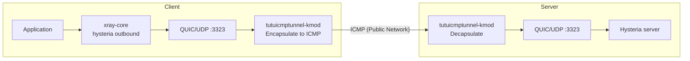

# xray-core Client + Hysteria Server (with tutuicmptunnel-kmod)

[English](./xray_hysteria.md) | [简体中文](./xray_hysteria_zh-CN.md)

---

`xray-core` (from v26.2.6) natively supports `hysteria` outbound: the client can directly connect to a Hysteria server using `xray-core`, while continuing to have `xray-core` manage outbound, routing, and split routing policies. Combined with `tutuicmptunnel-kmod`, you can encapsulate Hysteria's UDP traffic into ICMP for transmission.



> [!NOTE]
> This document assumes the Hysteria server uses port `3323`. If using other ports, please modify all example configurations accordingly.

> [!IMPORTANT]
> **Both server (Hysteria server) and client (xray-core) must set environment variable `QUIC_GO_DISABLE_GSO=1`**, otherwise `tutuicmptunnel-kmod` cannot work properly. When using systemd management, add to unit file:
>
> ```ini
> [Service]
> Environment="QUIC_GO_DISABLE_GSO=1"
> ```

## Server Configuration

The server still uses **Hysteria server**, configuration remains unchanged. Configure listening address/port, TLS certificates, authentication, congestion control and bandwidth policies according to your existing setup. Please confirm:

* Server actually listening UDP port matches client configuration
* Firewall has allowed the corresponding UDP port
* Domain certificate matches client's `serverName`
* If using relay, tunnel or `tutuicmptunnel-kmod`, forwarding target port should also be modified accordingly
* `QUIC_GO_DISABLE_GSO=1` has been set (see above)

## xray-core Client Configuration

The client uses `xray-core`'s `hysteria` outbound. Example configuration:

```json
"outbounds": [
  {
    "tag": "proxy",
    "protocol": "hysteria",
    "settings": {
      "version": 2,
      "address": "your-server.example.com",
      "port": 3323
    },
    "streamSettings": {
      "network": "hysteria",
      "hysteriaSettings": {
        "version": 2,
        "auth": "your_auth_token",
        "congestion": "bbr"
      },
      "security": "tls",
      "tlsSettings": {
        "serverName": "your-server.example.com",
        "alpn": ["h3"]
      }
    }
  }
]
```

Common configuration mistakes:

* Both `settings.version` and `hysteriaSettings.version` must be `2`
* `network` should be `"hysteria"`, `security` should be `"tls"`, `alpn` should be `["h3"]`
* Client port must match server listening port
* Client must also set `QUIC_GO_DISABLE_GSO=1`

## tutuicmptunnel-kmod Configuration

Tunnel configuration is basically the same as the [hysteria tutorial](/docs/hysteria.md), just change the target port to the one actually used by Hysteria (this example uses `3323`).

### 1. Check UID and Kernel Module

Confirm that both server and client have consistent configuration in `/etc/tutuicmptunnel/uids`:

```text
123 your_user_name
```

Confirm that both ends have loaded `tutuicmptunnel.ko` and `ktuctl` can access the device normally:

```bash
sudo lsmod | grep tutuicmptunnel
sudo ktuctl -d
```

### 2. Configure Sync Script

Save the following script on the client. After running, it will update tunnel rules on both client and server sides:

```bash
#!/bin/sh

V() {
  echo "$@"
  "$@"
}

TMP=$(mktemp)
export DEV=enp4s0 # Your client's network interface name

sudo ktuctl dump > "$TMP"
sudo rmmod tutuicmptunnel
sudo modprobe tutuicmptunnel

export TUTU_UID=your_user_name   # Replace with UID selected on server
export ADDRESS=your-server.example.com # Replace with your server domain or IP
export PORT=3323                 # Hysteria server UDP port

sudo ktuctl script - < "$TMP"
rm -f "$TMP"
sudo ktuctl load iface "$DEV"
sudo ktuctl client
sudo ktuctl client-del address "$ADDRESS" user "$TUTU_UID"
sudo ktuctl client-add address "$ADDRESS" port "$PORT" user "$TUTU_UID"

export COMMENT=your_client_name  # Replace with client comment
export HOST="$ADDRESS"
export PSK=your_psk_here         # Replace with your tuctl_server PSK
export SERVER_PORT=14801         # Replace with your tuctl_server port

printf "server\nserver-add uid $TUTU_UID address @client_ip@ port $PORT comment $COMMENT\n" | V tuctl_client \
  psk "$PSK" \
  server "$HOST" \
  server-port "$SERVER_PORT"

# vim: set sw=2 ts=2 et:
```

### 3. Start

Run the above script before starting the xray-core client. If using systemd to manage xray-core, you can write environment variables and pre-start script into the unit file to avoid manual execution:

```ini
[Service]
Environment="QUIC_GO_DISABLE_GSO=1"
ExecStartPre=/path/to/your/script.sh
```

## Auto-start and IP Changes

If the client's public IP changes, you can use `crontab` or `systemd` timer to periodically call the above script for automatic updates. For specific implementation, see the "Periodic Client IP Sync" section in the [hysteria tutorial](/docs/hysteria.md).