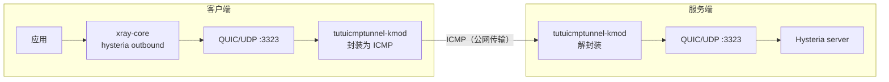

# xray-core 客户端 + Hysteria 服务端（配合 tutuicmptunnel-kmod）

[English](./xray_hysteria.md) | [简体中文](./xray_hysteria_zh-CN.md)

---

`xray-core`（v26.2.6 起）已原生支持 `hysteria` outbound：客户端可以直接用 `xray-core` 连接 Hysteria 服务端，同时继续由 `xray-core` 统一管理出站、路由与分流策略。再叠加 `tutuicmptunnel-kmod`，即可把 Hysteria 的 UDP 流量封装为 ICMP 传输。



> [!NOTE]
> 本文假定 Hysteria 服务端使用 `3323` 端口。如使用其他端口，请将文中所有示例配置同步修改。

> [!IMPORTANT]
> **服务端（Hysteria server）与客户端（xray-core）都必须设置环境变量 `QUIC_GO_DISABLE_GSO=1`**，否则 `tutuicmptunnel-kmod` 无法正常工作。使用 systemd 管理时，在单元文件中加入：
>
> ```ini
> [Service]
> Environment="QUIC_GO_DISABLE_GSO=1"
> ```

## 服务端配置

服务端仍使用 **Hysteria server**，配置方式保持不变，按你现有方式配置监听地址/端口、TLS 证书、认证口令、拥塞控制与带宽策略即可。请确认：

* 服务端实际监听的 UDP 端口与客户端配置一致
* 防火墙已放行对应的 UDP 端口
* 域名证书与客户端的 `serverName` 一致
* 若配合中转、隧道或 `tutuicmptunnel-kmod`，转发目标端口也同步修改
* 已设置 `QUIC_GO_DISABLE_GSO=1`（见上方说明）

## xray-core 客户端配置

客户端使用 `xray-core` 的 `hysteria` outbound。示例配置：

```json
"outbounds": [
  {
    "tag": "proxy",
    "protocol": "hysteria",
    "settings": {
      "version": 2,
      "address": "your-server.example.com",
      "port": 3323
    },
    "streamSettings": {
      "network": "hysteria",
      "hysteriaSettings": {
        "version": 2,
        "auth": "your_auth_token",
        "congestion": "bbr"
      },
      "security": "tls",
      "tlsSettings": {
        "serverName": "your-server.example.com",
        "alpn": ["h3"]
      }
    }
  }
]
```

几个容易配错的点：

* `settings.version` 与 `hysteriaSettings.version` 都必须为 `2`
* `network` 为 `"hysteria"`，`security` 为 `"tls"`，`alpn` 为 `["h3"]`
* 客户端端口与服务端监听端口一致
* 客户端同样必须设置 `QUIC_GO_DISABLE_GSO=1`

## tutuicmptunnel-kmod 配置

隧道配置与 [hysteria 教程](/docs/hysteria_zh-CN.md) 基本相同，只需将目标端口改为 Hysteria 实际使用的端口（本文示例为 `3323`）。

### 1. 检查 UID 与内核模块

确认服务器与客户端两侧的 `/etc/tutuicmptunnel/uids` 中有共同配置，例如：

```text
123 your_user_name
```

确认两侧均已加载 `tutuicmptunnel.ko`，且 `ktuctl` 可以正常访问设备：

```bash
sudo lsmod | grep tutuicmptunnel
sudo ktuctl -d
```

### 2. 配置同步脚本

在客户端保存以下脚本，运行后会同时更新客户端与服务器两侧的隧道规则：

```bash
#!/bin/sh

V() {
  echo "$@"
  "$@"
}

TMP=$(mktemp)
export DEV=enp4s0 # 你的客户端上网接口名

sudo ktuctl dump > "$TMP"
sudo rmmod tutuicmptunnel
sudo modprobe tutuicmptunnel

export TUTU_UID=your_user_name   # 替换为服务器上选好的 uid
export ADDRESS=your-server.example.com # 替换为你的服务端域名或 IP
export PORT=3323                 # Hysteria 服务端 UDP 端口

sudo ktuctl script - < "$TMP"
rm -f "$TMP"
sudo ktuctl load iface "$DEV"
sudo ktuctl client
sudo ktuctl client-del address "$ADDRESS" user "$TUTU_UID"
sudo ktuctl client-add address "$ADDRESS" port "$PORT" user "$TUTU_UID"

export COMMENT=your_client_name  # 替换为客户端注释
export HOST="$ADDRESS"
export PSK=your_psk_here         # 替换为你的 tuctl_server PSK
export SERVER_PORT=14801         # 替换为你的 tuctl_server 端口

printf "server\nserver-add uid $TUTU_UID address @client_ip@ port $PORT comment $COMMENT\n" | V tuctl_client \
  psk "$PSK" \
  server "$HOST" \
  server-port "$SERVER_PORT"

# vim: set sw=2 ts=2 et:
```

### 3. 启动

在启动 xray-core 客户端前运行上述脚本即可。如果使用 systemd 管理 xray-core，可以把环境变量和预启动脚本一起写进单元文件，免去手动执行：

```ini
[Service]
Environment="QUIC_GO_DISABLE_GSO=1"
ExecStartPre=/path/to/your/script.sh
```

## 开机自启与 IP 变更

如果客户端公网 IP 会变化，可以使用 `crontab` 或 `systemd` timer 定期调用上述脚本自动更新，具体写法参见 [hysteria 教程](/docs/hysteria_zh-CN.md) 的「定时同步客户端 IP」一节。
