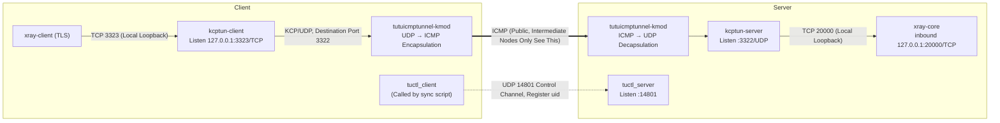

# Xray + KCPTun + tutuicmptunnel-kmod

[English](./xray_kcptun.md) | [简体中文](./xray_kcptun_zh-CN.md)

---

## Overview

`xray-core` is a commonly used network proxy tool. To improve transmission performance and anti-interference capability, you can layer `kcptun` on top:

1. On the server side, use the `xray-core` inbound listening address (usually TCP port) as the `kcptun-server`'s target, with `kcptun-server` listening on UDP port externally;
2. On the client side, run `kcptun-client` to convert local TCP traffic (like TLS) to KCP protocol (based on UDP) and send to server.

At this point, intermediate nodes see KCP (UDP) traffic, which sometimes gets targeted QoS throttling from ISPs. To address this, you can layer `tutuicmptunnel-kmod` on both ends to further encapsulate UDP traffic and convert it to ICMP traffic. This way, intermediate nodes only see ICMP packets, further improving traffic stealth and penetration capability.

The overall link is as follows:



- **Data Plane** (solid lines): `xray`'s TLS traffic → local `kcptun-client` → encapsulated as ICMP traversing public network → server decapsulation → `kcptun-server` → back to local `xray-core`.
- **Control Plane** (dashed lines): `tuctl_client` in `tutuicmptunnel_sync.sh` only registers uid and port with server's `tuctl_server` (14801), business traffic itself doesn't pass through it.

## Prerequisites

This document assumes:

- You already have a working `xray-core` server and client configuration, server listening on TCP 20000 port (TLS);
- Both server and client have the latest `kcptun` installed, executables located in `/usr/local/bin` directory. This document uses `kcptun-server` / `kcptun-client` as binary file names, please ensure they match the actual installed file names (use `ls /usr/local/bin/` to confirm).

The ports involved in this document:

| Port | Protocol | Location | Purpose |
| ----- | ---- | ------ | -------------------------- |
| 20000 | TCP | Server | `xray-core` inbound (TLS) |
| 3322 | UDP | Server | `kcptun-server` listening port |
| 3323 | TCP | Client | `kcptun-client` local listening |
| 14801 | UDP | Server | `tuctl_server` listening port |

The configuration proceeds in two steps:

1. Use `kcptun` to convert traffic on the link from TCP to UDP (KCP);
2. Use `tutuicmptunnel-kmod` to further encapsulate UDP traffic into ICMP for final penetration and obfuscation.

## Configure kcptun-server (Server)

Create environment variable file `/etc/default/kcptun-server`:

```bash
# SMUX version, generally keep at 2
KCPTUN_SMUXVER=2
# Encryption key, recommend generating randomly using the method below
KCPTUN_KEY=LC2N0lx5_Kq6l.6l
# Target: xray-core's inbound address
KCPTUN_TARGET=127.0.0.1:20000
# kcptun-server's UDP listening port
KCPTUN_LISTEN=:3322
KCPTUN_MODE=fast
KCPTUN_CRYPT=xor
KCPTUN_SOCKBUF=16777217
# KCP send window size
KCPTUN_SNDWND=4096
# KCP receive window size
KCPTUN_RCVWND=512
KCPTUN_DATASHARD=0
KCPTUN_PARITYSHARD=0
# KCP MTU, maximum 1444
KCPTUN_MTU=1400
```

Description:

- Encryption uses `xor`, which can somewhat mask traffic characteristics;
- Use the following command to generate a 16-byte random key:

```bash
python3 -c "import random, string; print('KCPTUN_KEY=' + ''.join(random.choices(string.ascii_letters + string.digits + '._', k=16)))"
```

- `KCPTUN_KEY` must be consistent between server and client.

> **Tip**: If `KCPTUN_SOCKBUF` exceeds the system's default socket buffer limit, you need to increase `net.core.rmem_max` / `net.core.wmem_max` accordingly, otherwise this setting won't take effect.

Create systemd unit file `/etc/systemd/system/kcptun@.service`:

```ini
[Unit]
Description=KCPTun Server
After=network.target

[Service]
Type=simple
EnvironmentFile=/etc/default/kcptun-%i
DynamicUser=yes
AmbientCapabilities=CAP_NET_BIND_SERVICE
ProtectSystem=full
ProtectHome=yes
NoNewPrivileges=true
PrivateTmp=yes
ProtectHostname=yes
ProtectClock=yes
ProtectKernelModules=yes
ProtectKernelTunables=yes
ProtectControlGroups=yes
RestrictSUIDSGID=yes
RestrictRealtime=yes
RestrictNamespaces=yes
LockPersonality=yes
LimitNOFILE=1048576

ExecStart=/usr/local/bin/kcptun-server \
  --smuxver "$KCPTUN_SMUXVER" \
  -t "$KCPTUN_TARGET" -l "$KCPTUN_LISTEN" \
  -mode "$KCPTUN_MODE" -nocomp \
  --datashard "$KCPTUN_DATASHARD" \
  --parityshard "$KCPTUN_PARITYSHARD" \
  --crypt "$KCPTUN_CRYPT" --key "$KCPTUN_KEY" \
  -sockbuf "$KCPTUN_SOCKBUF" \
  --sndwnd "$KCPTUN_SNDWND" --rcvwnd "$KCPTUN_RCVWND" \
  --mtu "$KCPTUN_MTU"

Restart=on-failure
RestartSec=2

[Install]
WantedBy=multi-user.target
```

Enable and start on boot:

```bash
sudo systemctl enable --now kcptun@server
```

## Configure kcptun-client (Client)

Create environment variable file `/etc/default/kcptun-client-yourhostname`:

```bash
# SMUX version, consistent with server
KCPTUN_SMUXVER=2
# Server address
KCPTUN_HOST=yourdomain.com
# Server kcptun's UDP port
KCPTUN_PORT=3322
# kcptun-client's local listening port (TCP)
KCPTUN_LOCAL_PORT=3323
KCPTUN_MODE=fast
KCPTUN_NOCOMP=-nocomp
# Auto-expire time for single UDP session (seconds), 0 or negative disables
KCPTUN_AUTOEXPIRE=900
KCPTUN_DATASHARD=0
KCPTUN_PARITYSHARD=0
KCPTUN_CRYPT=xor
# Same key as server
KCPTUN_KEY=LC2N0lx5_Kq6l.6l
KCPTUN_RCVWND=4096
KCPTUN_SNDWND=256
KCPTUN_SOCKBUF=16777217
KCPTUN_MTU=1400
```

Create systemd unit file `/etc/systemd/system/kcptun-client@.service`:

```ini
[Unit]
Description=KCPTun Client
After=network.target

[Service]
Type=simple
# Load environment variables (keys, etc.)
EnvironmentFile=/etc/default/kcptun-client-%i
# Use DynamicUser for better isolation
DynamicUser=yes
# Capability needed for listening on ports below 1024; using high ports here, keeping is fine
AmbientCapabilities=CAP_NET_BIND_SERVICE
# Filesystem and home directory protection
ProtectSystem=full
ProtectHome=yes
# Other security hardening items
NoNewPrivileges=true
PrivateTmp=yes
ProtectHostname=yes
ProtectClock=yes
ProtectKernelModules=yes
ProtectKernelTunables=yes
ProtectControlGroups=yes
RestrictSUIDSGID=yes
RestrictRealtime=yes
RestrictNamespaces=yes
LockPersonality=yes
# Resource limits, can be adjusted based on actual needs
LimitNOFILE=1048576

ExecStart=/usr/local/bin/kcptun-client \
    --smuxver "${KCPTUN_SMUXVER}" \
    -r "${KCPTUN_HOST}:${KCPTUN_PORT}" \
    -l ":${KCPTUN_LOCAL_PORT}" \
    -mode "${KCPTUN_MODE}" \
    ${KCPTUN_NOCOMP} \
    -autoexpire "${KCPTUN_AUTOEXPIRE}" \
    --datashard "${KCPTUN_DATASHARD}" \
    --parityshard "${KCPTUN_PARITYSHARD}" \
    --crypt "${KCPTUN_CRYPT}" \
    --key "${KCPTUN_KEY}" \
    --rcvwnd "${KCPTUN_RCVWND}" \
    --sndwnd "${KCPTUN_SNDWND}" \
    -sockbuf "${KCPTUN_SOCKBUF}" \
    --mtu "${KCPTUN_MTU}"

Restart=on-failure
RestartSec=2

[Install]
WantedBy=multi-user.target
```

Enable and start on boot:

```bash
sudo systemctl enable --now kcptun-client@yourhostname
# Check if process parameters match expectations
ps -ef | grep kcptun
```

## Modify Xray Client Export

Copy an existing client configuration (like `config-kcp.json`), change the server address in outbound to `127.0.0.1` and port to `3323` (i.e., `kcptun-client`'s local listening port), keep other configurations unchanged. This way, TLS traffic from `xray-client` will first go to local `kcptun-client`, which then sends it to the remote server.

Run `xray-core`:

```bash
xray -c config-kcp.json
```

Use `tcpdump` to confirm outbound traffic has become UDP (KCP):

```bash
sudo tcpdump -i any -n -v udp and port 3322
```

## Configure tutuicmptunnel-kmod

First, check if `tutu_csum_fixup` module is loaded on both server and client (recommended to enable):

```bash
sudo lsmod | grep tutu_csum_fixup
```

Then create sync script `/usr/local/bin/tutuicmptunnel_sync.sh`:

```bash
#!/bin/bash

V() {
  echo "$@"
  "$@"
}

TMP=$(mktemp)
DEV=enp4s0                # Client's network interface name

sudo ktuctl dump > "$TMP"
sudo rmmod tutuicmptunnel
sudo modprobe tutuicmptunnel

TUTU_UID=yourdevice       # UID assigned to this client on server
ADDRESS=yourdomain.com    # xray-core server's domain or IP
PORT=3322                 # Server kcptun-server listening UDP port (i.e., KCPTUN_LISTEN port)

sudo ktuctl script - < "$TMP"
sudo ktuctl load iface "$DEV"
sudo ktuctl client
sudo ktuctl client-add address "$ADDRESS" port "$PORT" user "$TUTU_UID"

COMMENT=yourdevice        # Client comment, will be displayed in server's ktuctl output
HOST=$ADDRESS
PSK=yourlongpsk           # tuctl_server's PSK passphrase
SERVER_PORT=14801          # tuctl_server's listening port

echo "server-add uid $TUTU_UID address @client_ip@ port $PORT comment $COMMENT" | V tuctl_client \
  psk "$PSK" \
  server "$HOST" \
  server-port "$SERVER_PORT"

# vim: set sw=2 ts=2 expandtab:
```

Note: `PORT` matches **the destination port of UDP packets on the network cable**, i.e., the server's `kcptun-server` listening port. The client's local `3323` only exists on the loopback interface and is TCP, won't appear as UDP on the network cable, so cannot be filled here.

Run this script. If everything is normal, `kcptun`'s UDP traffic will be encapsulated as ICMP traffic. You can observe with:

```bash
# Should see continuous ICMP packets
sudo tcpdump -i any -n -v icmp

# Can also confirm UDP traffic on port 3322 has disappeared
sudo tcpdump -i any -n -v udp and port 3322
```

## Auto-start

`tutuicmptunnel` configuration needs to be re-applied after kernel module loading. You can follow the approach in [hysteria](hysteria.md), using `crontab` or systemd timer to periodically call `/usr/local/bin/tutuicmptunnel_sync.sh` to achieve auto-start.