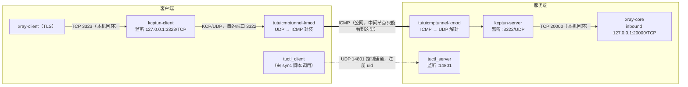

# Xray + KCPTun + tutuicmptunnel-kmod

## 概述

`xray-core` 是一款常用的网络代理工具。为了提升传输性能与抗干扰能力，可以在其之上叠加 `kcptun`：

1. 在服务端，将 `xray-core` inbound 的监听地址（通常为 TCP 端口）作为 `kcptun-server` 的回源目标（target），由 `kcptun-server` 对外监听 UDP 端口；
2. 在客户端运行 `kcptun-client`，将本地 TCP 流量（如 TLS）转换为 KCP 协议（基于 UDP）发往服务端。

此时，链路中间节点看到的是 KCP（UDP）流量，有时会被 ISP 针对性地 QoS 限速。为此，可以在两端再叠加 `tutuicmptunnel-kmod`，将 UDP 流量再封装一层、转换为 ICMP 流量。这样中间节点看到的仅仅是 ICMP 报文，流量的隐蔽性与穿透能力都得到进一步提升。

整体链路如下：



- **数据面**（粗实线）：`xray` 的 TLS 流量 → 本机 `kcptun-client` → 封装成 ICMP 穿越公网 → 服务端解封 → `kcptun-server` → 回源到本机 `xray-core`。
- **控制面**（虚线）：`tutuicmptunnel_sync.sh` 中的 `tuctl_client` 只是向服务端的 `tuctl_server`（14801）注册 uid 和端口，业务流量本身不经过它。

## 前提条件

本文假设：

- 你已有一套可用的 `xray-core` 服务端与客户端配置，服务端监听 TCP 20000 端口（TLS）；
- 服务端与客户端均已安装最新版 `kcptun`，可执行文件位于 `/usr/local/bin` 目录。本文统一使用 `kcptun-server` / `kcptun-client` 作为二进制文件名，请确保与实际安装的文件名一致（可用 `ls /usr/local/bin/` 确认）。

本文涉及的端口如下：

| 端口  | 协议 | 位置   | 用途                       |
| ----- | ---- | ------ | -------------------------- |
| 20000 | TCP  | 服务端 | `xray-core` inbound（TLS） |
| 3322  | UDP  | 服务端 | `kcptun-server` 监听端口   |
| 3323  | TCP  | 客户端 | `kcptun-client` 本地监听   |
| 14801  | UDP  | 服务端 | `tuctl_server` 监听端口    |

接下来的配置分两步进行：

1. 使用 `kcptun` 将链路上的流量从 TCP 转换为 UDP（KCP）；
2. 使用 `tutuicmptunnel-kmod` 将 UDP 流量进一步封装为 ICMP，实现最终的穿透与伪装。

## 配置 kcptun-server（服务端）

创建环境变量文件 `/etc/default/kcptun-server`：

```bash
# SMUX 版本，一般保持 2 即可
KCPTUN_SMUXVER=2
# 加密密钥，建议按下文方法随机生成
KCPTUN_KEY=LC2N0lx5_Kq6l.6l
# 回源目标：xray-core 的 inbound 地址
KCPTUN_TARGET=127.0.0.1:20000
# kcptun-server 的 UDP 监听端口
KCPTUN_LISTEN=:3322
KCPTUN_MODE=fast
KCPTUN_CRYPT=xor
KCPTUN_SOCKBUF=16777217
# KCP 发送窗口大小
KCPTUN_SNDWND=4096
# KCP 接收窗口大小
KCPTUN_RCVWND=512
KCPTUN_DATASHARD=0
KCPTUN_PARITYSHARD=0
# KCP MTU，最大 1444
KCPTUN_MTU=1400
```

说明：

- 加密方式使用 `xor`，可在一定程度上掩盖流量特征；
- 可使用以下命令生成 16 字节的随机密钥：

```bash
python3 -c "import random, string; print('KCPTUN_KEY=' + ''.join(random.choices(string.ascii_letters + string.digits + '._', k=16)))"
```

- 服务端与客户端的 `KCPTUN_KEY` 必须保持一致。

> **提示**：若 `KCPTUN_SOCKBUF` 超过系统默认的 socket buffer 上限，需相应调大 `net.core.rmem_max` / `net.core.wmem_max`，否则该设置不会生效。

创建 systemd 单元文件 `/etc/systemd/system/kcptun@.service`：

```ini
[Unit]
Description=KCPTun Server
After=network.target

[Service]
Type=simple
EnvironmentFile=/etc/default/kcptun-%i
DynamicUser=yes
AmbientCapabilities=CAP_NET_BIND_SERVICE
ProtectSystem=full
ProtectHome=yes
NoNewPrivileges=true
PrivateTmp=yes
ProtectHostname=yes
ProtectClock=yes
ProtectKernelModules=yes
ProtectKernelTunables=yes
ProtectControlGroups=yes
RestrictSUIDSGID=yes
RestrictRealtime=yes
RestrictNamespaces=yes
LockPersonality=yes
LimitNOFILE=1048576

ExecStart=/usr/local/bin/kcptun-server \
  --smuxver "$KCPTUN_SMUXVER" \
  -t "$KCPTUN_TARGET" -l "$KCPTUN_LISTEN" \
  -mode "$KCPTUN_MODE" -nocomp \
  --datashard "$KCPTUN_DATASHARD" \
  --parityshard "$KCPTUN_PARITYSHARD" \
  --crypt "$KCPTUN_CRYPT" --key "$KCPTUN_KEY" \
  -sockbuf "$KCPTUN_SOCKBUF" \
  --sndwnd "$KCPTUN_SNDWND" --rcvwnd "$KCPTUN_RCVWND" \
  --mtu "$KCPTUN_MTU"

Restart=on-failure
RestartSec=2

[Install]
WantedBy=multi-user.target
```

启动并设置开机自启：

```bash
sudo systemctl enable --now kcptun@server
```

## 配置 kcptun-client（客户端）

创建环境变量文件 `/etc/default/kcptun-client-yourhostname`：

```bash
# SMUX 版本，与服务端一致
KCPTUN_SMUXVER=2
# 服务端地址
KCPTUN_HOST=yourdomain.com
# 服务端 kcptun 的 UDP 端口
KCPTUN_PORT=3322
# kcptun-client 的本地监听端口（TCP）
KCPTUN_LOCAL_PORT=3323
KCPTUN_MODE=fast
KCPTUN_NOCOMP=-nocomp
# 单个 UDP 会话的自动过期时间（秒），0 或负数表示禁用
KCPTUN_AUTOEXPIRE=900
KCPTUN_DATASHARD=0
KCPTUN_PARITYSHARD=0
KCPTUN_CRYPT=xor
# 与服务端相同的密钥
KCPTUN_KEY=LC2N0lx5_Kq6l.6l
KCPTUN_RCVWND=4096
KCPTUN_SNDWND=256
KCPTUN_SOCKBUF=16777217
KCPTUN_MTU=1400
```

创建 systemd 单元文件 `/etc/systemd/system/kcptun-client@.service`：

```ini
[Unit]
Description=KCPTun Client
After=network.target

[Service]
Type=simple
# 载入环境变量（密钥等）
EnvironmentFile=/etc/default/kcptun-client-%i
# 使用 DynamicUser 提高隔离性
DynamicUser=yes
# 监听 1024 以下端口时需要的能力；本文使用高端口，保留亦无妨
AmbientCapabilities=CAP_NET_BIND_SERVICE
# 文件系统与家目录保护
ProtectSystem=full
ProtectHome=yes
# 其他安全加固项
NoNewPrivileges=true
PrivateTmp=yes
ProtectHostname=yes
ProtectClock=yes
ProtectKernelModules=yes
ProtectKernelTunables=yes
ProtectControlGroups=yes
RestrictSUIDSGID=yes
RestrictRealtime=yes
RestrictNamespaces=yes
LockPersonality=yes
# 资源限制，可根据实际需求调整
LimitNOFILE=1048576

ExecStart=/usr/local/bin/kcptun-client \
    --smuxver "${KCPTUN_SMUXVER}" \
    -r "${KCPTUN_HOST}:${KCPTUN_PORT}" \
    -l ":${KCPTUN_LOCAL_PORT}" \
    -mode "${KCPTUN_MODE}" \
    ${KCPTUN_NOCOMP} \
    -autoexpire "${KCPTUN_AUTOEXPIRE}" \
    --datashard "${KCPTUN_DATASHARD}" \
    --parityshard "${KCPTUN_PARITYSHARD}" \
    --crypt "${KCPTUN_CRYPT}" \
    --key "${KCPTUN_KEY}" \
    --rcvwnd "${KCPTUN_RCVWND}" \
    --sndwnd "${KCPTUN_SNDWND}" \
    -sockbuf "${KCPTUN_SOCKBUF}" \
    --mtu "${KCPTUN_MTU}"

Restart=on-failure
RestartSec=2

[Install]
WantedBy=multi-user.target
```

启动并设置开机自启：

```bash
sudo systemctl enable --now kcptun-client@yourhostname
# 检查进程参数是否符合预期
ps -ef | grep kcptun
```

## 修改 Xray 客户端出口

复制一份现有的客户端配置（如 `config-kcp.json`），将 outbound 中的服务器地址改为 `127.0.0.1`、端口改为 `3323`（即 `kcptun-client` 的本地监听端口），其余配置保持不变。这样 `xray-client` 发出的 TLS 流量会先交给本地的 `kcptun-client`，再由它负责送往远端服务器。

运行 `xray-core`：

```bash
xray -c config-kcp.json
```

用 `tcpdump` 确认出口流量已变为 UDP（KCP）：

```bash
sudo tcpdump -i any -n -v udp and port 3322
```

## 配置 tutuicmptunnel-kmod

首先，在服务端与客户端分别检查 `tutu_csum_fixup` 模块是否已加载（推荐启用）：

```bash
sudo lsmod | grep tutu_csum_fixup
```

然后创建同步脚本 `/usr/local/bin/tutuicmptunnel_sync.sh`：

```bash
#!/bin/bash

V() {
  echo "$@"
  "$@"
}

TMP=$(mktemp)
DEV=enp4s0                # 客户端的上网接口名

sudo ktuctl dump > "$TMP"
sudo rmmod tutuicmptunnel
sudo modprobe tutuicmptunnel

TUTU_UID=yourdevice       # 服务端为该客户端分配的 UID
ADDRESS=yourdomain.com    # xray-core 服务端的域名或 IP
PORT=3322                 # 服务端 kcptun-server 监听的 UDP 端口（即 KCPTUN_LISTEN 的端口）

sudo ktuctl script - < "$TMP"
sudo ktuctl load iface "$DEV"
sudo ktuctl client
sudo ktuctl client-add address "$ADDRESS" port "$PORT" user "$TUTU_UID"

COMMENT=yourdevice        # 客户端注释，会显示在服务端的 ktuctl 输出中
HOST=$ADDRESS
PSK=yourlongpsk           # tuctl_server 的 PSK 口令
SERVER_PORT=14801          # tuctl_server 的监听端口

echo "server-add uid $TUTU_UID address @client_ip@ port $PORT comment $COMMENT" | V tuctl_client \
  psk "$PSK" \
  server "$HOST" \
  server-port "$SERVER_PORT"

# vim: set sw=2 ts=2 expandtab:
```

注意：`PORT` 匹配的是**网线上 UDP 包的目的端口**，即服务端 `kcptun-server` 的监听端口。客户端本地的 `3323` 只存在于回环网卡上、且是 TCP，不会以 UDP 形式出现在网线上，因此不能填在这里。

运行该脚本。一切正常的话，`kcptun` 的 UDP 流量将被封装为 ICMP 流量。可用以下命令观察：

```bash
# 应能看到持续的 ICMP 报文
sudo tcpdump -i any -n -v icmp

# 同时可确认 3322 端口的 UDP 流量已消失
sudo tcpdump -i any -n -v udp and port 3322
```

## 开机自启

`tutuicmptunnel` 的配置需要在内核模块加载后重新下发。可参见 [hysteria](hysteria.md) 中的做法，使用 `crontab` 或 systemd timer 定期调用 `/usr/local/bin/tutuicmptunnel_sync.sh`，实现开机自启。
