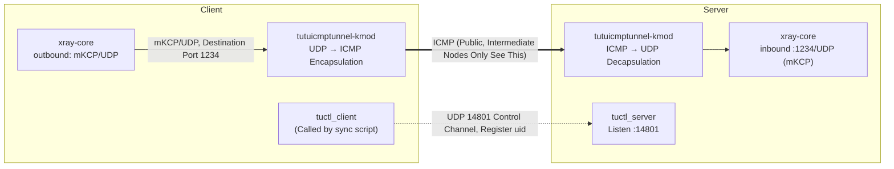

# Xray mKCP + tutuicmptunnel-kmod

[English](./xray_mkcp.md) | [简体中文](./xray_mkcp_zh-CN.md)

---

## Overview

`xray-core`'s built-in `mKCP` transport can replace the "`xray-core` + `kcptun`" dual-process approach. Main advantages:

- Eliminates data copying and context switching overhead between two processes;
- `mKCP` has tighter integration with `xray-core`'s scheduling and implementation, more efficient;
- Natively supports multiple `mKCP` connections concurrently, avoiding head-of-line blocking of single `KCP` connection.

After layering `tutuicmptunnel-kmod`, intermediate nodes still only see ICMP packets. The overall link is as follows:



## Prerequisites

- Both ends have `xray-core` installed;
- Server has TLS certificates prepared (example paths in this document: `/etc/xray/xray.crt` and `/etc/xray/xray.key`);
- Both ends have `tutuicmptunnel-kmod` and supporting tools installed (`ktuctl`, `tuctl_client`, `tuctl_server`).

Ports involved in this document:

| Port | Protocol | Location | Purpose |
| ----- | ---- | ------ | ----------------------------- |
| 1234 | UDP | Server | `xray-core` mKCP inbound |
| 14801 | UDP | Server | `tuctl_server` listening port |

## Configure xray-core

### Server Configuration

```json
"inbounds": [
  {
    "protocol": "vless",
    "port": 1234,
    "settings": {
      "decryption": "none",
      "clients": [
        {
          "id": "your_xray_id",
          "flow": "xtls-rprx-vision"
        }
      ]
    },
    "streamSettings": {
      "network": "kcp",
      "kcpSettings": {
        "mtu": 1450,
        "tti": 100,
        "congestion": true,
        "uplinkCapacity": 5,
        "downlinkCapacity": 100,
        "readBufferSize": 2,
        "writeBufferSize": 3
      },
      "security": "tls",
      "tlsSettings": {
        "minVersion": "1.3",
        "alpn": ["h2", "http/1.1"],
        "certificates": [
          {
            "certificateFile": "/etc/xray/xray.crt",
            "keyFile": "/etc/xray/xkey.key"
          }
        ]
      }
    }
  }
]
```

### Client Configuration

```json
"outbounds": [
  {
    "tag": "proxy",
    "protocol": "vless",
    "settings": {
      "vnext": [
        {
          "address": "your_vps_ip",
          "port": 1234,
          "users": [
            {
              "id": "your_xray_id",
              "encryption": "none",
              "flow": "xtls-rprx-vision"
            }
          ]
        }
      ]
    },
    "streamSettings": {
      "network": "kcp",
      "kcpSettings": {
        "mtu": 1450,
        "tti": 100,
        "congestion": true,
        "uplinkCapacity": 2,
        "downlinkCapacity": 100,
        "readBufferSize": 5,   // ≈ ⌈server writeBufferSize(3) × 1.5⌉
        "writeBufferSize": 1
      },
      "security": "tls",
      "tlsSettings": {
        "allowInsecure": false,
        "serverName": "your_vps_domain_name",
        "alpn": ["h2"],
        "fingerprint": "chrome"
      }
    },
    "mux": { "enabled": false, "concurrency": -1 }
  }
]
```

> Note: The user `id` must be consistent on both ends (i.e., `your_xray_id` is the same placeholder).

Key points:

- **Capacity**: `uplinkCapacity` / `downlinkCapacity` units are MB/s, used for mKCP rate estimation, not rate limiting. `uplinkCapacity` should be close to actual available uplink bandwidth; `downlinkCapacity` can be set larger (like 100) to avoid becoming a downlink bottleneck.
- **Buffer**: `readBufferSize` / `writeBufferSize` units are MB. Server's `writeBufferSize` approximates `sndwnd` in the kcptun approach — too large will cause instant packet flooding, overwhelming client or intermediate network queues.
- **Empirical values**: Client `readBufferSize` should be around $\lceil \textit{writeBufferSize}_{\text{server}} \times 1.5 \rceil$ (e.g., if server is 3, client should be 5), balancing throughput and latency.
- **tti**: Unit is ms, and somewhat counter-intuitively — shorter send intervals don't necessarily mean faster; after `tutuicmptunnel` encapsulation, excessive packet rates may trigger ICMP rate limiting on the link. Recommend testing different values.
- **Others**: Fine-tune `mtu`, `congestion` based on link and hardware, and observe throughput, RTT, packet loss and CPU usage.

## Configure tutuicmptunnel-kmod

First, confirm that both ends have consistent uid entries in `/etc/tutuicmptunnel/uids` (format: `uid username`):

```text
123 your_user_name
```

Then confirm both ends have loaded `tutuicmptunnel.ko` and `ktuctl` can access the device normally:

```bash
sudo lsmod | grep tutuicmptunnel
sudo ktuctl -d
```

Run the following script on the client to simultaneously apply configuration on both client and server sides:

```bash
#!/bin/sh

V() {
  echo "$@"
  "$@"
}

TMP=$(mktemp)
DEV=enp4s0                # Client's network interface name

sudo ktuctl dump > "$TMP"
sudo rmmod tutuicmptunnel
sudo modprobe tutuicmptunnel

TUTU_UID=your_user_name   # UID assigned to this client on server (consistent with /etc/tutuicmptunnel/uids)
ADDRESS=yourdomain.com    # xray-core server's domain or IP
PORT=1234                 # Server xray-core mKCP inbound UDP port

sudo ktuctl script - < "$TMP"
rm -f "$TMP"
sudo ktuctl client
sudo ktuctl load iface "$DEV"
sudo ktuctl client-del address "$ADDRESS" user "$TUTU_UID"   # Delete old entry first, ensuring repeatability
sudo ktuctl client-add address "$ADDRESS" port "$PORT" user "$TUTU_UID"

COMMENT=your_client_name  # Client comment, will be displayed in server's ktuctl output
HOST=$ADDRESS
PSK=yourlongpsk           # tuctl_server's PSK passphrase
SERVER_PORT=14801         # tuctl_server's listening port

printf "server\nserver-add uid $TUTU_UID address @client_ip@ port $PORT comment $COMMENT\n" | V tuctl_client \
  psk "$PSK" \
  server "$HOST" \
  server-port "$SERVER_PORT"

# vim: set sw=2 ts=2 expandtab:
```

Run this script before starting the `xray-core` client. You can also attach it to `xray-core`'s systemd unit for automatic execution, eliminating manual runs:

```ini
[Service]
ExecStartPre=/usr/local/bin/tutuicmptunnel_sync.sh
```

Don't forget to grant execute permission: `sudo chmod +x /usr/local/bin/tutuicmptunnel_sync.sh`.

## Auto-start

`tutuicmptunnel` configuration needs to be re-applied after kernel module loading. You can follow the approach in [hysteria](hysteria.md), using `crontab` or systemd timer to periodically call the above script to achieve auto-start.

## See Also

- [xray-core mKCP Official Documentation](https://xtls.github.io/en/config/transports/mkcp.html)