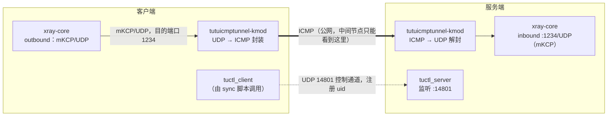

# Xray mKCP + tutuicmptunnel-kmod

## 概述

`xray-core` 内置的 `mKCP` 传输可以替代「`xray-core` + `kcptun`」双进程方案，主要优势：

- 省去了两个进程之间的数据拷贝与上下文切换开销；
- `mKCP` 与 `xray-core` 的调度与实现结合更紧密，效率更高；
- 原生支持多条 `mKCP` 连接并发，避免单条 `KCP` 连接的队头阻塞（head-of-line blocking）。

再叠加 `tutuicmptunnel-kmod` 后，链路中间节点看到的仍然只是 ICMP 报文。整体链路如下：



## 前提条件

- 两端均已安装 `xray-core`；
- 服务端已准备好 TLS 证书（本文示例路径为 `/etc/xray/xray.crt` 与 `/etc/xray/xray.key`）；
- 两端均已安装 `tutuicmptunnel-kmod` 及配套工具（`ktuctl`、`tuctl_client`、`tuctl_server`）。

本文涉及的端口：

| 端口  | 协议 | 位置   | 用途                          |
| ----- | ---- | ------ | ----------------------------- |
| 1234  | UDP  | 服务端 | `xray-core` mKCP inbound      |
| 14801 | UDP  | 服务端 | `tuctl_server` 监听端口       |

## 配置 xray-core

### 服务端配置

```json
"inbounds": [
  {
    "protocol": "vless",
    "port": 1234,
    "settings": {
      "decryption": "none",
      "clients": [
        {
          "id": "your_xray_id",
          "flow": "xtls-rprx-vision"
        }
      ]
    },
    "streamSettings": {
      "network": "kcp",
      "kcpSettings": {
        "mtu": 1450,
        "tti": 100,
        "congestion": true,
        "uplinkCapacity": 5,
        "downlinkCapacity": 100,
        "readBufferSize": 2,
        "writeBufferSize": 3
      },
      "security": "tls",
      "tlsSettings": {
        "minVersion": "1.3",
        "alpn": ["h2", "http/1.1"],
        "certificates": [
          {
            "certificateFile": "/etc/xray/xray.crt",
            "keyFile": "/etc/xray/xkey.key"
          }
        ]
      }
    }
  }
]
```

### 客户端配置

```json
"outbounds": [
  {
    "tag": "proxy",
    "protocol": "vless",
    "settings": {
      "vnext": [
        {
          "address": "your_vps_ip",
          "port": 1234,
          "users": [
            {
              "id": "your_xray_id",
              "encryption": "none",
              "flow": "xtls-rprx-vision"
            }
          ]
        }
      ]
    },
    "streamSettings": {
      "network": "kcp",
      "kcpSettings": {
        "mtu": 1450,
        "tti": 100,
        "congestion": true,
        "uplinkCapacity": 2,
        "downlinkCapacity": 100,
        "readBufferSize": 5,   // ≈ ⌈服务端 writeBufferSize(3) × 1.5⌉
        "writeBufferSize": 1
      },
      "security": "tls",
      "tlsSettings": {
        "allowInsecure": false,
        "serverName": "your_vps_domain_name",
        "alpn": ["h2"],
        "fingerprint": "chrome"
      }
    },
    "mux": { "enabled": false, "concurrency": -1 }
  }
]
```

> 注意：两端用户的 `id` 必须一致（即 `your_xray_id` 为同一占位符）。

要点：

- **容量**：`uplinkCapacity` / `downlinkCapacity` 单位为 MB/s，用于 mKCP 的速率估算，并非限速。`uplinkCapacity` 应贴近实际可用的上行带宽；`downlinkCapacity` 可设大一些（如 100），避免成为下行瓶颈。
- **缓冲区**：`readBufferSize` / `writeBufferSize` 单位为 MB。服务端的 `writeBufferSize` 近似 kcptun 方案中的 `sndwnd`——过大会造成瞬时发包洪水，压垮客户端或中间网络队列。
- **经验值**：客户端 `readBufferSize` 取 $\lceil \textit{writeBufferSize}_{\text{服务端}} \times 1.5 \rceil$ 左右（如服务端为 3，客户端取 5），在吞吐与时延之间较为均衡。
- **tti**：单位为 ms，且有些反直觉——发送间隔太短未必更快；经 `tutuicmptunnel` 封装后，过高的包速率反而可能触发链路的 ICMP 限速。建议实测对比不同取值。
- **其他**：根据链路与硬件微调 `mtu`、`congestion`，并观察吞吐、RTT、丢包与 CPU 占用。

## 配置 tutuicmptunnel-kmod

首先，确认两端的 `/etc/tutuicmptunnel/uids` 中存在一致的 uid 条目（格式为 `uid 用户名`）：

```text
123 your_user_name
```

然后确认两端均已加载 `tutuicmptunnel.ko`，且 `ktuctl` 可以正常访问设备：

```bash
sudo lsmod | grep tutuicmptunnel
sudo ktuctl -d
```

在客户端运行以下脚本，即可同时下发客户端与服务端两侧的配置：

```bash
#!/bin/sh

V() {
  echo "$@"
  "$@"
}

TMP=$(mktemp)
DEV=enp4s0                # 客户端的上网接口名

sudo ktuctl dump > "$TMP"
sudo rmmod tutuicmptunnel
sudo modprobe tutuicmptunnel

TUTU_UID=your_user_name   # 服务端为该客户端分配的 uid（与 /etc/tutuicmptunnel/uids 一致）
ADDRESS=yourdomain.com    # xray-core 服务端的域名或 IP
PORT=1234                 # 服务端 xray-core mKCP inbound 的 UDP 端口

sudo ktuctl script - < "$TMP"
rm -f "$TMP"
sudo ktuctl client
sudo ktuctl load iface "$DEV"
sudo ktuctl client-del address "$ADDRESS" user "$TUTU_UID"   # 先删旧条目，保证可重复执行
sudo ktuctl client-add address "$ADDRESS" port "$PORT" user "$TUTU_UID"

COMMENT=your_client_name  # 客户端注释，会显示在服务端的 ktuctl 输出中
HOST=$ADDRESS
PSK=yourlongpsk           # tuctl_server 的 PSK 口令
SERVER_PORT=14801         # tuctl_server 的监听端口

printf "server\nserver-add uid $TUTU_UID address @client_ip@ port $PORT comment $COMMENT\n" | V tuctl_client \
  psk "$PSK" \
  server "$HOST" \
  server-port "$SERVER_PORT"

# vim: set sw=2 ts=2 expandtab:
```

在启动 `xray-core` 客户端之前运行该脚本即可。也可以把它挂到 `xray-core` 的 systemd 单元中自动执行，省去每次手动运行：

```ini
[Service]
ExecStartPre=/usr/local/bin/tutuicmptunnel_sync.sh
```

别忘了先赋予执行权限：`sudo chmod +x /usr/local/bin/tutuicmptunnel_sync.sh`。

## 开机自启

`tutuicmptunnel` 的配置需要在内核模块加载后重新下发。可参见 [hysteria](hysteria.md) 中的做法，使用 `crontab` 或 systemd timer 定期调用上述脚本，实现开机自启。

## 参见

- [xray-core mKCP 官方文档](https://xtls.github.io/en/config/transports/mkcp.html)
