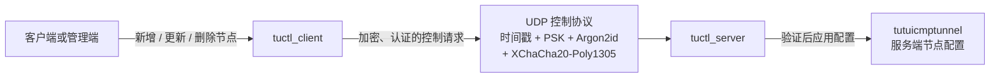
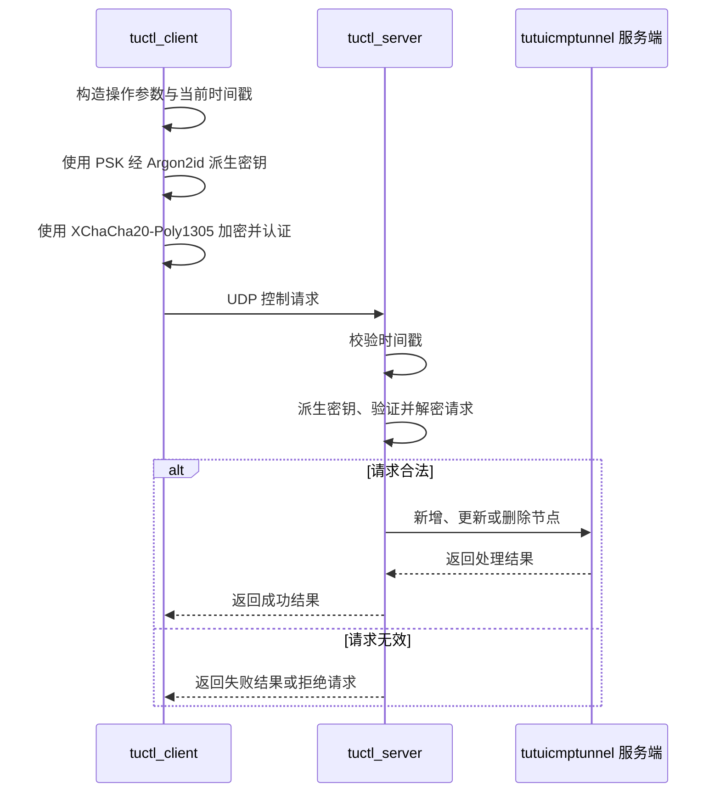
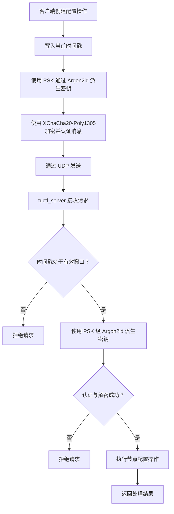
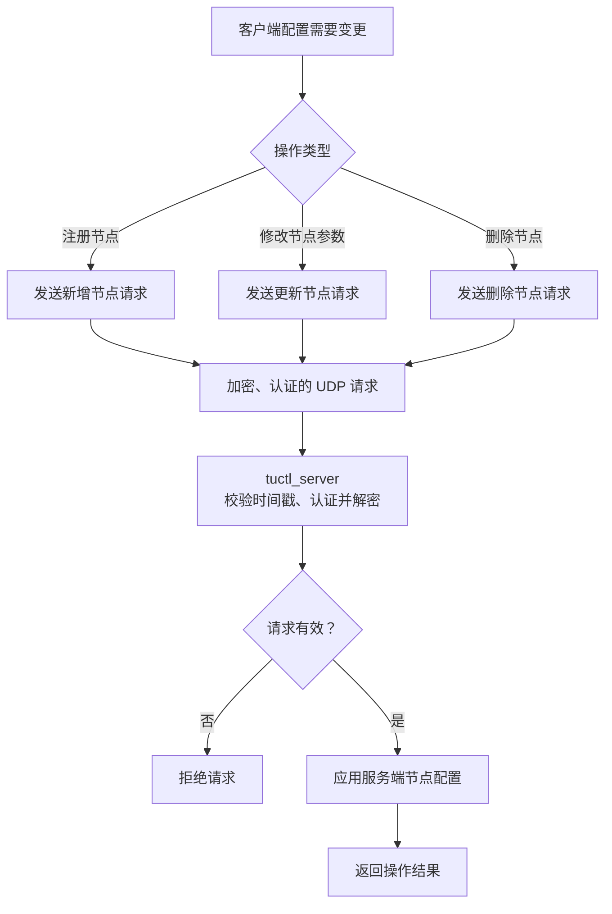

# tuserver

`tuserver` 是 `tutuicmptunnel` 的控制工具目录，包含用于管理服务端隧道节点配置的两个程序：

- `tuctl_server`：运行在隧道服务端，接收、验证并处理控制请求；
- `tuctl_client`：运行在客户端或管理端，向 `tuctl_server` 发送节点配置操作。

两者通过 UDP 控制协议通信，用于实时新增、更新或删除服务端的隧道节点配置。

控制协议结合基于时间戳的有效期校验、预共享密钥（PSK）、Argon2id 密钥派生以及 XChaCha20-Poly1305 认证加密，使客户端能够安全、高效地将新的配置信息通知到服务器。

## 目录结构

```text
tuserver/
├── tuctl_server    # 服务端控制程序
└── tuctl_client    # 客户端控制程序
```

| 工具 | 运行位置 | 职责 |
|---|---|---|
| `tuctl_server` | 隧道服务器 | 监听 UDP 控制请求；校验时间戳；认证、解密请求；执行服务端节点配置操作。 |
| `tuctl_client` | 客户端或管理端 | 构造节点管理请求；使用 PSK 派生密钥；加密、认证后通过 UDP 发送给服务端。 |

## 架构



## 工作流程

客户端需要变更服务端隧道节点配置时，调用 `tuctl_client` 发送控制请求。服务端的 `tuctl_server` 接收请求、验证其合法性，并在验证成功后执行相应操作。



典型操作包括：

- 注册新的隧道节点；
- 更新节点的客户端地址、端口或其他参数；
- 删除不再使用的节点；
- 在客户端公网地址或网络环境变化后重新提交节点配置。

## 控制协议安全性

`tuctl_client` 与 `tuctl_server` 使用 UDP 传输控制消息。UDP 不需要建立长期连接，适合发送低开销、实时的节点配置更新请求。

控制协议包含以下安全机制：

| 机制 | 作用 |
|---|---|
| UDP | 传输控制请求和响应，开销较低。 |
| PSK | 客户端和服务端共享的认证秘密。 |
| Argon2id | 从 PSK 派生实际用于保护控制消息的密钥。 |
| XChaCha20-Poly1305 | 提供消息加密和完整性校验，防止内容被窃听或篡改。 |
| 时间戳校验 | 限制请求的有效期，降低旧请求被重放的风险。 |



## 时间戳与重放保护

每个控制请求包含时间戳。`tuctl_server` 只接受处于允许时间窗口内的请求。

这能够：

- 拒绝明显过期的配置请求；
- 降低攻击者截获旧 UDP 数据报后重复发送的风险；
- 防止已经失效的配置操作在较晚时间被再次执行。

客户端与服务器应保持合理的时间同步。若两端系统时间偏差过大，服务端可能拒绝本应合法的请求。

建议在两端启用 NTP 或其他可靠的时间同步机制。

## PSK 与认证加密

PSK 是客户端与服务端之间共享的秘密，是控制协议认证的基础。

控制消息不会直接以明文传输 PSK，也不应简单地直接使用 PSK 作为消息加密密钥。协议通过 **Argon2id** 从 PSK 派生密钥，再使用 **XChaCha20-Poly1305** 对控制消息进行认证加密。

因此，只有持有正确 PSK 的客户端才能构造通过服务端验证的请求。

XChaCha20-Poly1305 为控制消息提供：

- **机密性**：第三方无法直接读取节点配置和控制参数；
- **完整性**：服务端可以检测传输过程中的消息篡改；
- **认证性**：没有正确密钥的请求无法通过验证。

## 配置操作流程



## 安全建议

### 使用高强度 PSK

PSK 应足够长、随机且不重复。建议：

- 使用安全随机数生成器或密码管理器生成；
- 不同服务器、客户端或安全域使用不同 PSK；
- 定期轮换长期使用的密钥；
- 怀疑泄露时立即更换对应 PSK。

不要使用：

- 常见单词或短密码；
- 与域名、节点名直接相关的字符串；
- 与其他服务复用的密码；
- 已提交至公开仓库、脚本或日志中的密钥。

### 保护配置与日志

PSK 和节点配置均属于敏感数据。应当：

- 限制配置文件的读取权限；
- 避免将真实 PSK 写入日志；
- 避免将包含真实密钥的文件提交至版本控制系统；
- 避免在 shell 历史、进程列表或监控系统中暴露密钥。

### 限制 UDP 端口暴露

建议仅开放 `tuctl_server` 实际使用的 UDP 端口，并在可行时通过防火墙限制允许访问的来源范围。

协议本身具备认证与加密保护，但网络层访问控制仍有助于减少扫描、无效流量和拒绝服务攻击的影响。

## 故障排查

### 客户端请求未生效

按以下顺序检查：

1. `tuctl_server` 是否正常运行并监听预期 UDP 端口；
2. 服务端防火墙、云安全组和上游网络是否放行 UDP 流量；
3. 客户端与服务端的 PSK 是否完全一致；
4. 两端系统时间是否存在明显偏差；
5. 请求中的节点标识、地址、端口等参数是否有效；
6. 服务端日志是否存在时间戳校验、认证或解密失败信息。

### 请求被拒绝

| 可能原因 | 排查方式 |
|---|---|
| PSK 不匹配 | 确认两端配置的 PSK 完全相同。 |
| 请求时间戳过期 | 检查客户端和服务端的系统时间与 NTP 状态。 |
| 认证或解密失败 | 检查 PSK、请求格式和两端协议版本。 |
| UDP 流量被拦截 | 检查主机防火墙、云防火墙和网络策略。 |
| 参数不合法 | 检查节点 UID、地址、端口及其他必填字段。 |
