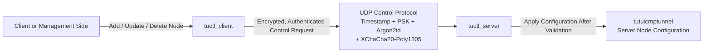
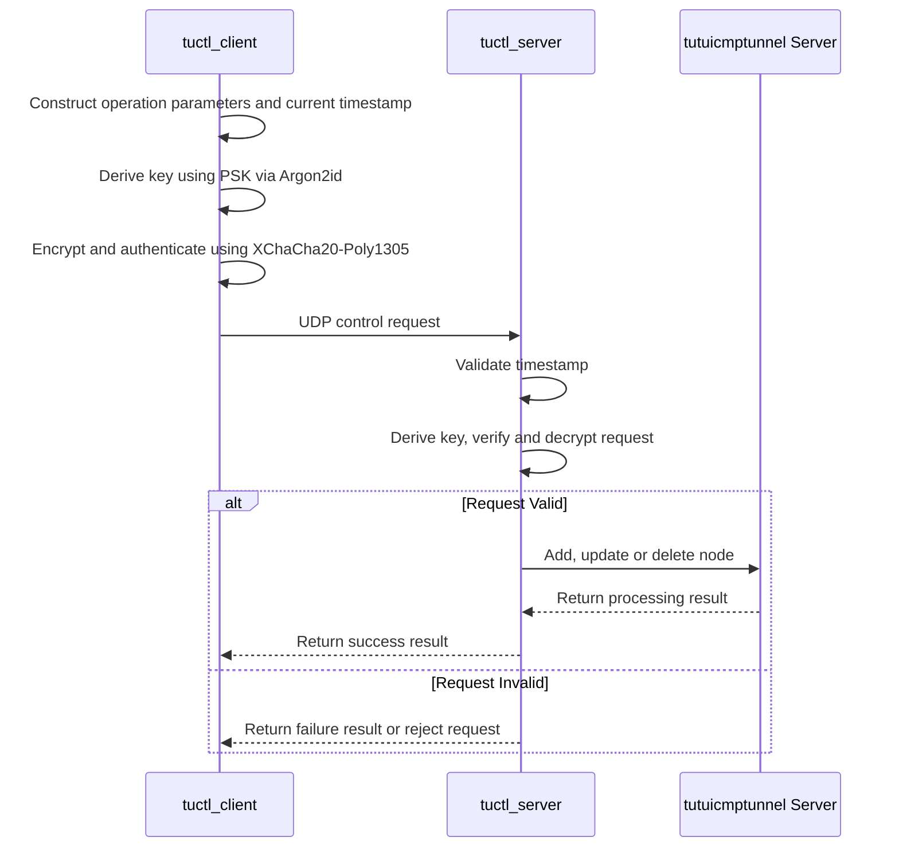
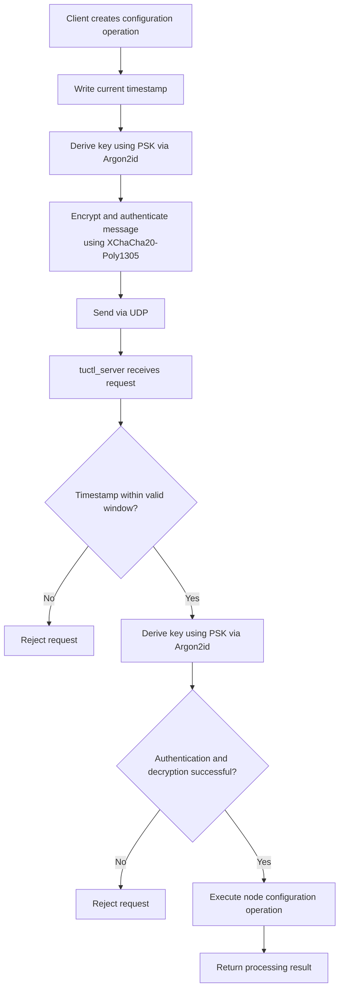
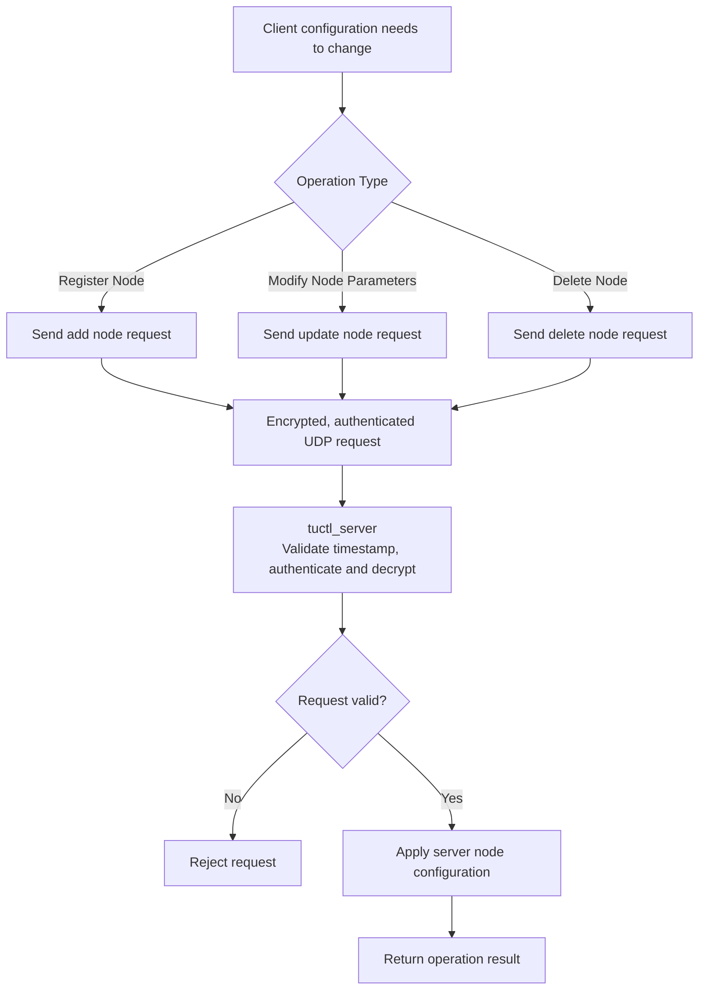

[English](./README.md) | [简体中文](./README_zh-CN.md)

---

# tuserver

`tuserver` is the control tool directory for `tutuicmptunnel`, containing two programs for managing server-side tunnel node configurations:

- `tuctl_server`: runs on the tunnel server, receives, validates and processes control requests;
- `tuctl_client`: runs on the client or management side, sends node configuration operations to `tuctl_server`.

The two communicate via a UDP control protocol, used for real-time addition, update or deletion of server-side tunnel node configurations.

The control protocol combines timestamp-based expiry validation, pre-shared key (PSK), Argon2id key derivation and XChaCha20-Poly1305 authenticated encryption, enabling the client to securely and efficiently notify the server of new configuration information.

## Directory Structure

```text
tuserver/
├── tuctl_server    # Server-side control program
└── tuctl_client    # Client-side control program
```

| Tool | Runs On | Responsibilities |
|---|---|---|
| `tuctl_server` | Tunnel server | Listens for UDP control requests; validates timestamps; authenticates and decrypts requests; executes server-side node configuration operations. |
| `tuctl_client` | Client or management side | Constructs node management requests; derives keys using PSK; encrypts, authenticates and sends to the server via UDP. |

## Architecture



## Workflow

When the client needs to change the server-side tunnel node configuration, it calls `tuctl_client` to send a control request. The server's `tuctl_server` receives the request, validates its legitimacy, and executes the corresponding operation upon successful validation.



Typical operations include:

- Registering a new tunnel node;
- Updating a node's client address, port or other parameters;
- Deleting a node that is no longer in use;
- Resubmitting node configuration after the client's public IP address or network environment changes.

## Control Protocol Security

`tuctl_client` and `tuctl_server` use UDP to transmit control messages. UDP does not require establishing a long-lived connection, making it suitable for sending low-overhead, real-time node configuration update requests.

The control protocol includes the following security mechanisms:

| Mechanism | Purpose |
|---|---|
| UDP | Transports control requests and responses with low overhead. |
| PSK | Shared authentication secret between client and server. |
| Argon2id | Derives the actual key used to protect control messages from the PSK. |
| XChaCha20-Poly1305 | Provides message encryption and integrity verification, preventing content from being eavesdropped or tampered with. |
| Timestamp Validation | Limits the validity window of requests, reducing the risk of old requests being replayed. |



## Timestamp and Replay Protection

Each control request contains a timestamp. `tuctl_server` only accepts requests that fall within the allowed time window.

This enables:

- Rejecting obviously expired configuration requests;
- Reducing the risk of attackers replaying intercepted old UDP datagrams;
- Preventing configuration operations that have already expired from being executed at a later time.

The client and server should maintain reasonable time synchronization. If the system time difference between the two sides is too large, the server may reject requests that should otherwise be valid.

It is recommended to enable NTP or other reliable time synchronization mechanisms on both sides.

## PSK and Authenticated Encryption

The PSK is the shared secret between the client and server, and is the foundation of control protocol authentication.

Control messages do not transmit the PSK in plaintext directly, nor should the PSK simply be used directly as the message encryption key. The protocol derives keys from the PSK using **Argon2id**, then uses **XChaCha20-Poly1305** for authenticated encryption of control messages.

Therefore, only clients holding the correct PSK can construct requests that pass server validation.

XChaCha20-Poly1305 provides the following for control messages:

- **Confidentiality**: Third parties cannot directly read node configurations and control parameters;
- **Integrity**: The server can detect message tampering during transmission;
- **Authentication**: Requests without the correct key cannot pass validation.

## Configuration Operation Flow



## Security Recommendations

### Use High-Strength PSK

The PSK should be sufficiently long, random and non-repetitive. Recommendations:

- Use a secure random number generator or password manager to generate;
- Use different PSKs for different servers, clients or security domains;
- Regularly rotate long-term keys;
- Immediately replace the corresponding PSK if a leak is suspected.

Do not use:

- Common words or short passwords;
- Strings directly related to domain names or node names;
- Passwords reused from other services;
- Keys that have been committed to public repositories, scripts or logs.

### Protect Configuration and Logs

Both the PSK and node configuration are sensitive data. You should:

- Restrict read permissions on configuration files;
- Avoid writing real PSKs to logs;
- Avoid committing files containing real keys to version control systems;
- Avoid exposing keys in shell history, process lists or monitoring systems.

### Limit UDP Port Exposure

It is recommended to only open the UDP port actually used by `tuctl_server` and, where feasible, restrict the allowed access sources through a firewall.

The protocol itself has authentication and encryption protection, but network-layer access control still helps reduce the impact of scanning, invalid traffic and denial-of-service attacks.

## Troubleshooting

### Client Requests Not Taking Effect

Check in the following order:

1. Whether `tuctl_server` is running normally and listening on the expected UDP port;
2. Whether the server firewall, cloud security groups and upstream networks allow UDP traffic;
3. Whether the PSK on the client and server sides are exactly the same;
4. Whether there is a significant time deviation between the two systems;
5. Whether the node identifier, address, port and other parameters in the request are valid;
6. Whether the server logs contain timestamp validation, authentication or decryption failure messages.

### Request Rejected

| Possible Cause | Troubleshooting Method |
|---|---|
| PSK Mismatch | Confirm that the PSK configured on both sides is exactly the same. |
| Request Timestamp Expired | Check the system time and NTP status on both client and server. |
| Authentication or Decryption Failed | Check the PSK, request format and protocol versions on both sides. |
| UDP Traffic Intercepted | Check host firewall, cloud firewall and network policies. |
| Invalid Parameters | Check node UID, address, port and other required fields. |


`@client_ip@` is a placeholder; `tuctl_server` will automatically replace it with the client's UDP source address when executing scripts.
